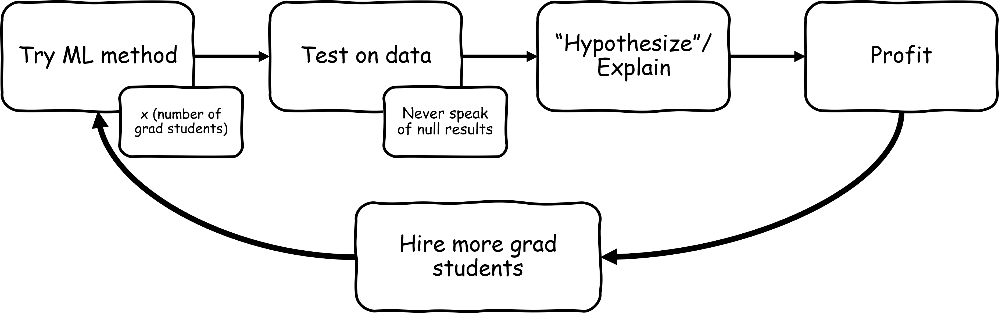
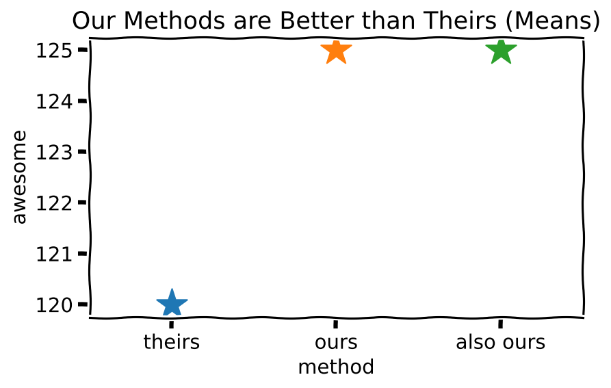
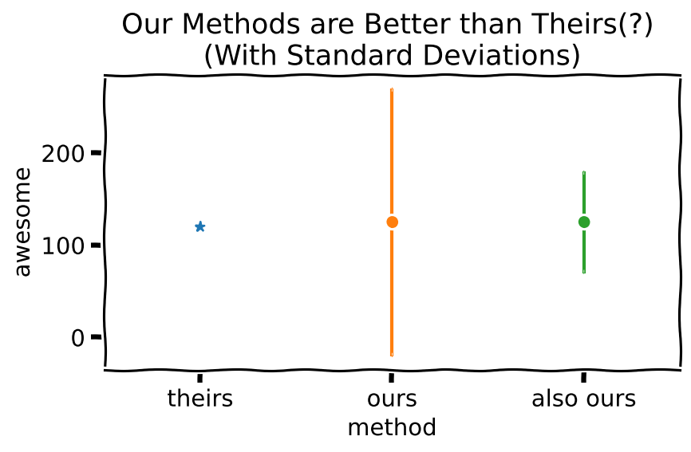
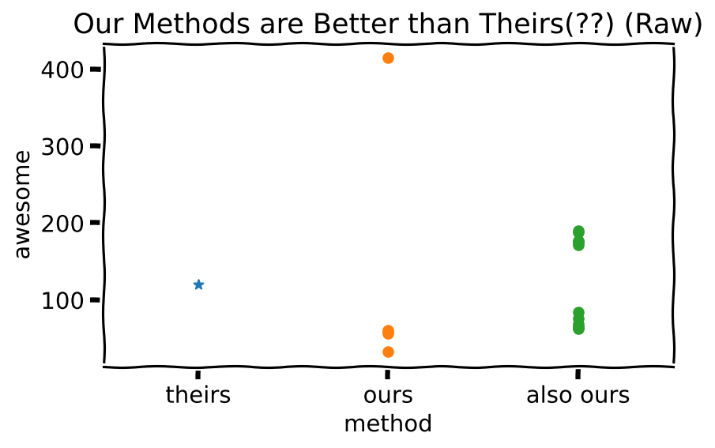
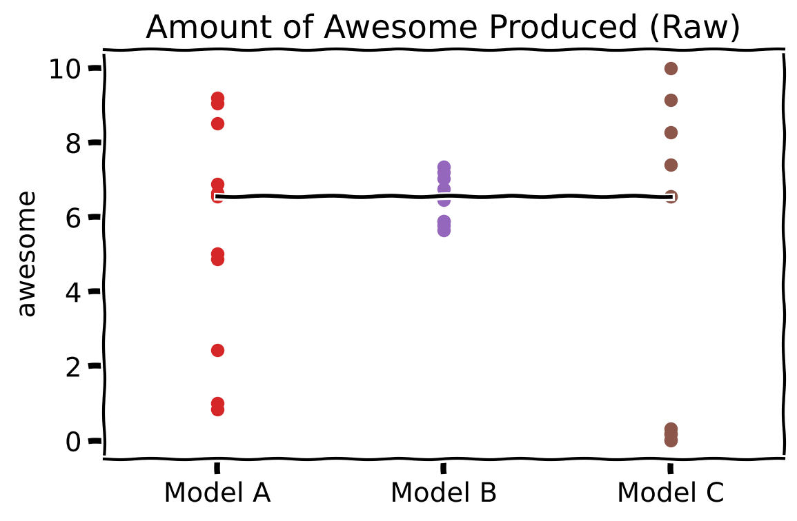

# Lecture 01 - Machine Learning, Statistics, and the Scientific Method

> Every time a scientific paper presents a bit of data, it's accompanied by an error bar – a quiet but insistent reminder that no knowledge is complete or perfect. - Carl Sagan

Bottom Line Up Front:

* Modern machine learning is largely an empirical, experimental, but unscientific discipline
* Point estimates alone almost never justify experimental conclusions
* Traditional statistics can help machine learning engineers design better experiments, paint a much more complete picture of results, and draw more correct conclusions

---

## Learning Objectives

* Describe the components of a scientific experiment
* Describe the typical differences between scientific and machine learning experiments
* Define descriptive and inferential statistics
* Understand how to assess machine learning literature for statistical rigor
* Identify approaches to uncertainty quantification in black-box analysis of machine learning systems

---

Modern machine learning is amazing. It has given us not only computer programs that can tell images of cats from images of not-cats, but also programs that can help fly aircraft, recommend your next favorite movie, approve or deny loans, suggest sentences for convicted criminals, write plays and symphonies, and convince some of us that they are sentient[^invocation].

But in the rush to give the learned machines unto all things and all people, much of the field seems to have forgotten some basic principles of how to examine these miraculous manifestations. Let's take a few steps back to remember what we used to know. In this lecture, we're going to be focusing on two major issues in the machine learning literature, as motivation for why we should care about statistical analysis of machine learning systems. We'll start by looking at uncertainty in measurement, and scientific hypotheses, how the field has(n't) applied these principles, what the impacts are, and then make a first pass at what we can do in response.

[^invocation]: Most ML papers seem to begin with this type of praising invocation, and who am I to break that tradition? Also, if this list felt a little jarring in scope and impact, then good. I often find machine learning to be a little jarring as well.

---

The National Council of Teachers of Mathematics, Standards and Positions on Measurement gives the following expectations for grades 9 through 12:

"_...each and every student should analyze precision, accuracy, and approximate error in measurement situations..._"

Collectively, these expectations cover the idea of _uncertainty quantification_ in measurement.

On a related note, recall (perhaps also from approximately grades 9 through 12, but likely even earlier), that the scientific method involves the following steps:

* an observation or a question
* a research topic area
* a _hypothesis_
* a test with an experiment
* data analysis
* reporting of conclusions

---
Some quick definitions[^definitions] before we check up on the state of machine learning:

> ___Uncertainty___ - parameter associated with the result of a measurement, that characterizes the dispersion of the values that could reasonably be attributed to the measurand [the thing being measured]

> ___Accuracy___ - closeness of agreement between a measured value and a true value

> ___Precision___ - the degree of consistency and agreement among independent measurements of a quantity under the same conditions

> ___Hypothesis___ - an assumption, an idea that is proposed for the sake of argument so that it can be tested to see if it might be true. In the scientific method, the hypothesis is constructed before any applicable research has been done, apart from a basic background review.

The definitions given for uncertainty, accuracy, and precision, refer to these definitions "for measurement" (as opposed to, say, the moral or definitional forms). 

[^definitions]: Uncertainty, Accuracy, and Precision from Vim, I. S. O. "International vocabulary of basic and general terms in metrology (VIM)." International Organization 2004 (2004): 09-14. Hypothesis from “Hypothesis.” Merriam-Webster.com Dictionary, Merriam-Webster, https://www.merriam-webster.com/dictionary/hypothesis.

---

## A quest for science

Now let's take a look at the state of machine learning. In this examination, we'll take a very basic approach, using just the ideas of uncertainty quantification and the use of hypotheses, and ask the following questions in our search for science:

1. Does the paper appropriately quantify any kind of uncertainty?
2. Does the paper state and test one or more hypotheses?

For quantifying uncertainty, I counted rather liberally, including _any and all_ methods of showing data dispersion (box plots, standard deviations, standard errors, confidence intervals, etc), and for "should show uncertainty," I included anything with a summary statistic (mean, median, top X, etc) or any single-run figure that is used to support a broader argument that actually requires inference beyond the single case.

For stating and testing hypotheses, I am looking for any mention of hypotheses at all, but particularly for null and alternate hypotheses. I am not counting cases of implied hypotheses of the form "we tested/modified/tried X because Y" or "we tested/modified/tried X to see if Y" because these implied cases are typically very muddled with methods, results, and discussion, and do not meet the definition of hypothesis previously presented.

These counts are subject to some debate, but I do not believe that the definitional uncertainties here take away from the point of the chart.

| Paper | Domain | Tables/Figures that should show uncertainty | Tables/Figures that show uncertainty | Stated hypotheses | Tested hypotheses | Notes |
| --- | --- | --- | --- | --- | ---- | --- |  
| AlexNet[^Krizhevksy12] | vision | 2 | 0 | 0 | 0 | They're first out the gate in modern machine learning, so maybe we give them a pass.
| Attention Mechanism[^Bahdanau14] | NLP | 2 | 0 | 0 | 0| Bengio (the senior author) co-wrote several papers that we'll talk about later on calculating variance in ML performance settings. Oddly, those papers were all published before this one, which contains no dispersion measures.
| ResNet[^He15] | vision | 15 | 1 (partial) | 0 | 0 | Partial because that table only showed 2 standard deviations out of 12 means. I'll grant that 3 of the figures are loss plots and might be viewed as case studies, but if that's the case, they're improperly generalized as experimental evidence in the paper.
| DIAYN[^Eysenbach19] | RL (for control) | 4 | 2 (both in supplemental) | 0 | 0 | RL tends to be much better than other subfields of ML in terms of showing _some_ uncertainties, but RL also has its own issues.
| Cicero[^META22] | NLP + RL (for games) | 13 | 3 (all in supplemental) |  0 | 0 | Embarrassingly, this paper had 26 authors and was published in _Science_, of all places.

[^Krizhevksy12]: Krizhevsky, Alex, et al. ‘ImageNet Classification with Deep Convolutional Neural Networks’. Advances in Neural Information Processing Systems, 2012 (the AlexNet paper, AKA the beginning of time as far as deep learning is concerned)

[^Bahdanau14]: Bahdanau, Dzmitry, Kyunghyun Cho, and Yoshua Bengio. "Neural machine translation by jointly learning to align and translate." International Conference on Learning Representations (2014).

[^He15]: He, Kaiming, et al. "Deep residual learning for image recognition." Proceedings of the IEEE conference on computer vision and pattern recognition. 2016.

[^Eysenbach19]: Eysenbach, Benjamin, et al. "Diversity is all you need: Learning skills without a reward function." International Conference on Learning Representations (2019).

[^META22]: Meta Fundamental AI Research Diplomacy Team (FAIR), et al. "Human-level play in the game of Diplomacy by combining language models with strategic reasoning." Science 378.6624 (2022): 1067-1074.

This is a mildly depressing table, though we haven't fully explored why yet. You can wait until the end of this lecture to get a better sense of just how depressing it is. For now, just let the sense of impending doom hang over you.

Effectively, what these papers are doing (and I would argue, the field is very much used to) is drawing conclusions from _point estimates_.

> A __point estimate__ ($\hat{\theta}$) of a parameter $\theta$ is a single number that can be thought of as a reasonable value of $\theta$:
>
>$$\hat{\theta} = \theta + \epsilon,$$
>for some estimation error $\epsilon$[^theta]. Typical point estimates of centrality are _means_ and _medians_.

[^theta]: Folks coming from machine learning may recognize $\theta$ as the same notation that is used for the set of parameters in a model that we are trying to optimize, and $\hat{\theta}$ as the model parameters we end up with after the optimization process (though these are typically thought of as a collection of parameters that comprise an entire model rather than a single value). That makes sense, because in both contexts, these are very nearly denoting the same thing!

Furthermore, they are doing so without following the scientific method, and positing hypotheses to be tested.

Now, are these handpicked examples? Kind of - I was selecting for a diverse set of high-impact papers, not for papers with good or bad methodology. These were literally the first papers I looked up for this purpose. With that in mind, I doubt there would be much argument against these papers being among the most influential papers in their respective domains (with the possible current exception of Cicero, because of how recent it is).

__Disclaimer__ (before they take my machine learning card away for insulting my elders): I should note that I don't necessarily doubt the efficacy of the _machine learning_ methods in these papers (it's rather difficult to in many cases). Their inclusion here is to illustrate a broader point about scientific analysis and communication in even some of the best work in the field.[^guity]

[^guity]: Also, my own publication record shows that I am not innocent of all this either, something made painfully obvious at points in the creation of this course.

Clearly, improper (or non-) usage of the scientific method and statistical analysis is not an impediment to getting published (and maybe even doing good work) in the machine learning world, but why is there still that feeling of impending doom? What's the worst that could happen?

## Samples, populations, and what we are trying to describe

Now one way to split up what we think of as "statistics" is along the axis of which data we are actually trying to describe - the sample or the population. 

>A ___sample___ is a subset of the true set of things in the world (the ___population___) that we are really trying to understand.

> ___Descriptive statistics___ seek the parameters that describe the _sample_. Examples include _sample mean_ ($m$), _sample variance_ ($s^2$), and so on.

Sample statistics can be calculated directly from the data we have available, and we can be sure that they describe our sample accurately.

> ___Inferential statistics___ seek the parameters that describe the _population_. Examples include _population mean_ ($\mu$), _population variance_ ($\sigma^2$), and so on.

Inferential statistics are what we seek when we want to make generalizations from the sample to the populaton. In these cases, might, for example, caculate a population mean and include a measure of how confident we are about that value, given potential sampling.

As described in the boxes above, typical point estimates of data dispersion are sample _variance_ $s^2$ and sample _standard deviation_ $s$. Sometimes, you will also see the _standard error (of the mean)_, which measures the distribution of the _mean_ on repeated sampling, and is $s_m=\frac{s}{\sqrt{n}}$ where $n$ is the number of samples. Percentile measures (and equivalently, boxplots) are also commonly shown alongside the median as a way of representing dispersion.

These kinds of dispersion measures are the parameters that are very frequently lacking in the machine learning literature, leading to a whole host of problems about what can and cannot be claimed, but are generally claimed anyway.

What kind of problems, you ask? Let me answer this question in two ways - from the literature, examining large-scale effects on the field, and by mathematical example.

## Point estimates are not enough: An argument from literature

A group of people from Google Brain and the University of Montreal [^Agarwal21] examined a collection of published results in deep reinforcement learning that used standard deep RL benchmarks:

_"Most published results on deep RL benchmarks compare point estimates of aggregate performance such as mean and median scores across tasks, ignoring the statistical uncertainty implied by the use of a finite number of training runs... [on the Atari100K benchmark] we find substantial discrepancies between conclusions drawn from point estimates alone versus a more thorough statistical analysis"._

In their broader re-evaluation of algorithms used for the Atari Learning Environment (ALE), they found results that deviated substantially from those reported in literature when multiple algorithms were compared under the same conditions, leading to very different results. Furthermore, it was impossible to directly compare results from different papers against each other due to highly variable evaluation protocols and low numbers of replicates within each work. Similar concerns were also found for ProcGen, and DeepMind Control Suite, additional benchmark RL environments.

Here, we see that the original benchmark papers were trying to generalize their results from just a few runs - making claims about the _population_ of models that could have occurred using their advocated learning methods, from the _sample_ of models that they actually trianed. This follow-on study showed how you can't just make such claims when you're not following proper experimental or statistical protocol.

These evaluations highlight the difficulty in only showing point estimates, and in showing medians in particular (a popular choice in RL work). Without an emphasis on measurement uncertainty and repeated evaluations, even a well-meaning reader could not effectively draw practical conclusions from the RL work.

[^Agarwal21]: Agarwal, Rishabh, et al. "Deep reinforcement learning at the edge of the statistical precipice." Advances in neural information processing systems 34 (2021): 29304-29320.

In another paper [^Gencoglu19], a group of researchers found that the current methods used in machine learning, and particularly in deep learning, are rife with examples of _HARKing_: hypothesizing after the results are known. From the traditional flow of the scientific method presented above, we can tell immediately that this ordering of methods is unscientific, but what exactly is wrong with it?

First, the initial statement of a hypothesis before testing is one of the grounds of the scientific method. It forces us as researchers to think about and research potential causes and effects of the subject in question. HARKing, in contrast, has a much stronger tendency to muddle explanation and speculation, and neglect an informed decision-making process in driving model design decisions.

Second, HARKing makes us prone to _SotA-hacking_ (SotA = state of the art) or _p-hacking_, where we simply try things over and over again, and wait for the non-deterministic nature of our machine learning methods to eventually return a positive result. The more workers (typically grad students) you have, the greater the volume of results you can churn through, and the faster you can obtain least publishable units (and tenure). The number of workers you can have trying different non-deterministic models, of course, can be increased by the greater positive press that you obtain from the initial incredible results, leading to a most (un)virtuous cycle of ever-increasing publication counts. If you remembered that initial list of fields that was alluded to where ML has some impact, this positive feedback loop should be concerning.

It certainly doesn't help that controlling statistical tests for multiple comparisons (discussed in a later lecture) is practically unheard of in the machine learning world. Not that statistical testing is generally heard of either.

Third, and as should be obvious at this point, HARKing gives weight to the random, and brings about a tendency to _only show positive examples_, with some suitably conjured explanation following it. While I am sure that rain dances are indeed sometimes followed by rain, HARKed results driving any of the decision-making we mentioned at the very beginning of this lecture is likely contributing to more than a few unfortunate "real-world" results.

[^Gencoglu19]: Gencoglu, Oguzhan, et al. "HARK Side of Deep Learning--From Grad Student Descent to Automated Machine Learning." arXiv preprint arXiv:1904.07633 (2019).

These are two examples of some specific criticisms of current ML work. For a broader view, I'd also recommend Lipton and Steinhardt's _Troubling Trends in Machine Learning Scholarship_[^Lipton2019]. Two of their four major criticisms (failure to distinguish explanation and speculation - i.e. HARKing, and failure to identify sources of empirical gains - i.e. lack of proper experimental and statistical design) relate directly to our topics at hand.

[^Lipton2019]: Lipton, Zachary C., and Jacob Steinhardt. "Troubling Trends in Machine Learning Scholarship: Some ML papers suffer from flaws that could mislead the public and stymie future research." Queue (2019).

## Point estimates are not enough: An argument from example

But let's set aside the high-level arguments of these papers for a moment and do our own homework. Can we convince ourselves that the use of point estimates is insufficient, and can we get a sense of just how bad the results can be?

### Deception by means

If you give it a little thought, you can probably think of a few ways in which it is fairly easy to unfairly present data when you only have means. Consider the example below, where Our Research Group has produced two machine learning methods that are clearly superior to the method employed Their Research Group:

Per the standards of machine learning literature, we have not presented any dispersion measures. In many cases in the literature, these data would simply be presented on a table, but we have decided to go a step further and actually plot them. Here, you can see that Our Research Group has produced not one, but two completely distinct methods of producing Awesome that are five points better than the state of the art. But what if we look a bit closer? Including errorbars representing the standard deviation, as is often standard in scientific endeavors, we produce... uh... hm.

Our methods are still clearly, uh, better, maybe. But perhaps our second method is more consistent than the first. But there's also something about the first method maybe producing _negative awesome_? Is _that_ what the standard deviation means? That will not do. Of course, it's rather difficult for us to compare against the errorbars in the literature because they didn't bother to produce them for us. But now we are suspicious. Definitely of their data, but also, unfortunately, of ours.

Well, we can pretty clearly see that in Our Method N $^\circ$ 1, one of our models is producing much more Awesome than any of the others, and in Our Method N $^\circ$ 2, there seems to be two different groupings of models, one of which lies below the state of the art, and the other which lies well above. We also see that there are in fact no data points in either of our methods that returns _negative awesome_ (thank goodness), but that means there's something quite odd about our previous plot.

### Deception by medians

Medians are worse in some ways. At the very least, if you take enough samples, the mean of your samples starts to approach the true mean (of the population) and the errors $\epsilon$ in our $\hat{\mu} = \mu + \epsilon$ equation are symmetric. We say that the sample mean is an _unbiased estimator_ of the true mean. Medians have no such scruples.

Here's a different example, highlighting the problem with medians.

In this case, we see an example of three data distributions where the medians are exactly the same (the black line), but the data are completely different, and there is no requirement that they be symmetric around the median. Medians allow approximately half of the data to vary almost completely unconstrained, with no impact on the point estimate. Non-symmetric residuals are quite common in regression problems if you're plotting loss, due to the nature of the mean _squared_ error, the most common loss function by far.

In some kinds of statistics (e.g. robust statistics) the way that medians behave can be a good thing, since we aren't affected by outliers. But as far as using the median alone as a point estimate to understand the performance of a model, we can clearly see that very little can actually be gleaned from it alone. In fact, this figure was generated in such a way so that we could still see the points (more or less), but you can imagine cases where the non-median values are in fact orders of magnitude away from the median, as long as they are on the "correct side" of the median.

## Point estimates of centrality are insufficient for inferential statistics

Do these examples _necessarily_ show that there is "deception" at hand and rife in the ML literature? No. What they do show, however, is that the typical methods fall far short of what grade school science teachers would ask for, and that we frankly cannot be sure that there is _not_ such deception happening, intentional or not. There is, after all, likely a strong bias towards publishing only the best of results to optimize our Grad Student Descent process.

Given how much machine learning places an emphasis on the idea of "inference" it is maybe a little surprising that the limits of "inference" seem to have been lost in the literature. So far in this lecture, we have been focusing on the idea of descriptive statistics, which are analogous to "training performance" in machine learning. But ultimately, what matters in both classical statistics and machine learning is _generalization_ (or _test performance_), analogous to _inferential statistics_. We can see intuitively from the examples above how reporting just point estimates gives us not only a poor understanding of a model's ability to generalize to the broader population, but also how it might impact other aspects of fair, responsible, safe, etc etc AI. We can also see that reporting dispersion measures are probably better than just reporting point estimates, but they too, can be insufficient.

In the next lecture, we'll go into _statistical testing_ where we'll quickly observe that dispersion measures are required for any type of inferential statistics.

## Is your paper statistically sound?

I should clarify that when I say "your" paper, I mean that in a general "you." Of course, you are free to apply that to yourself, which may be a good question to ask anyway.

So how can we check if people are making claims in scientific papers in scientifically and statistically defensible ways? Here, I present a table of questions to ask yourself of _any_ experimental paper (not just in ML). I also provide a bit of a rarity rating based on what I've seen in the ML literature specifically (using Magic the Gathering ratings, because why not[^mtg]). I encourage you to use this checklist on the next ML paper you read (or better yet, the next ML paper you review).

[^mtg]: A subtle suggestion for you to go out and see if you can collect (or produce!) the rarest of papers.

| Question | Typical Indicators | Rarity in ML Literature |
| --- | --- | --- |
| __Has the paper avoided HARKing?__ | hypotheses are stated upfront (though this isn't a guarantee of non-HARKing), non-significant results are presented alongside significant results | Rare |
| __Are there measures of centrality?__ | means, medians | Common |
| __Are there measures of uncertainty/dispersion?__ | standard deviations, standard errors, percentiles, confidence intervals, box plots | Rare, at least in complete form
| __Are there indications of distribution shape?__ | raw data, histograms, normality tests, box plots, violin plots | Rare, other than raw data, and if it's raw data, it's likely an RL paper with <5 model training replicates
| __Are there statistical tests when differences are claimed between methods/models?__ | t-tests, F-tests, ANOVA, $\chi^2$ tests | Mythic Rare |
| __Are the right tests being performed?__ | Hard to say what typical indicators are without doing a full stats class, but hopefully you'll have a sense at the end of this crash course. | unknown - too few samples from previous row |
| __Are there corrections for multiple tests?__ | Bonferroni correction, false discovery rate, Sidak correction, step-down/step-up procedures, Tukey correction | Mythic Rare |

And no, we haven't talked specifically about statistical testing, or multiple comparison corrections yet. Those are upcoming in the next few lectures. Do all "sound" papers need all of these? Perhaps not all, and perhaps not just in the ways described here, but these absolutely should be questions that the experimenters keep in mind, and have extremely good justification for when they are not used.

## What should our response be?

As an experimentalist (which, if you are in machine learning, you are, unless you're one of those rare, blessed, ML theorists in the back), you will have choices about how to conduct your experiments, how to present data, what kind of analyses to perform, and so on. There are often going to be some ways that are better than others[^Paul], but very rarely will there be absolute demands imposed on your choices (much more on this in the next two lectures).

[^Paul]: _"'All things are lawful,' but not all things are helpful."_ - Paul's First Epistle to the Statisticians, probably.

As experimentalists, we should have a few goals in mind:

* We want to design experiments to answer research questions backed by testable hypotheses.
* We want to present the data as faithfully as we reasonably can (oftentimes balancing against clarity of presentation).
* We want to use appropriate mathematical tools to analyze our data against our hypotheses.
* We _don't_ want to let random chance drive our groundbreaking results.

## How to science as an ML engineer

We said at the beginning of this lecture that machine learning has largely become an empirical, experimental, but unscientific discipline. So apart from learning some statistics and experimental design, what should we be doing at a high level as ML engineers to make our scientific forebears squirm a little less?

### __State your hypotheses upfront.__

Go ahead, make a claim! Just make sure that it's testable. The most common type of machine learning hypothesis (that is basically never stated) is "our model is better than the state of the art" - this is a hypothesis, and is fine. Once you start making hypotheses, you'll realize that there are a bunch of other factors you might consider - what if we varied this parameter or that one, what if we added this type of feature or that type? Then we're getting into more serious experimental design. Machine learning has the wonderful property of letting you do parameter sweeps and ablation studies to your heart's content that can help answer these questions. Also, be careful how much empirical performance gain you attribute to the design choices you might be championing, vs just hyperparameter tuning, and account for this in your hypotheses and methods.

### __Look at the data (LATFD) [^latfd].__
Before you calculate the sample statistics of your experiment, visualize the raw values if you can. Scatterplots and histograms can be great ways to represent raw data (these are the _only_ kinds of measurements that have no associated error [^counts]). These visualizations will give you a qualitative sense of the the volume, centrality, dispersion and the shape of your data distribution, which can be immensely helpful in guiding your analysis. We'll come back to this in more detail in Lecture 4.

[^latfd]: I was taught this name by Prof. Chris Carr, who very much emphasized this step. He also mentioned that one of these letters is silent in polite company, but was definitely there.

[^counts]: Technically, _counts_ (perhaps as represented by histograms) are the only kinds of measurements that have no associated error in general. Individual datapoints (as in scatterplots) will have "measurement error" in most types of experiments, but this isn't a factor we need to consider in purely computer-based experiments.

### __Express your uncertainty.__

Report your uncertainties - use standard deviations, use box plots, use confidence intervals, and so on, as appropriate for your data. And be explicit about the number of repetitions of your experiment - keeping in mind that an $n$ of 1 is not so much an experiment as it is a case study (and very subject to dumb luck).

## A note on machine learning models

This course treats machine learning models as black boxes, examining them as subjects of an experiment. We are focused on how we can frame a machine learning research enterprise as a scientific endeavor, set up these experiments, analyze the results, and present the results. We will talk about specific practices in broad areas of ML and hone in on common problematic practices and ways to fix them, but we will not examine models, model architectures, or the like, other than the decision-making process that controls them as experiment variables. For our purposes, it does not matter to us if they are "uncertainty-aware" or not, deep or shallow, techno-organic or Amish-approved. Feel free to substitute any model we speak of in this lecture with a collection of dice, a trained pigeon[^pigeon], or a bored colleague. What we are covering will still apply.

[^pigeon]: https://en.wikipedia.org/wiki/Project_Pigeon