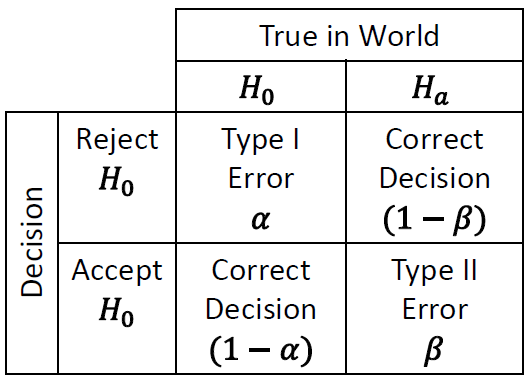
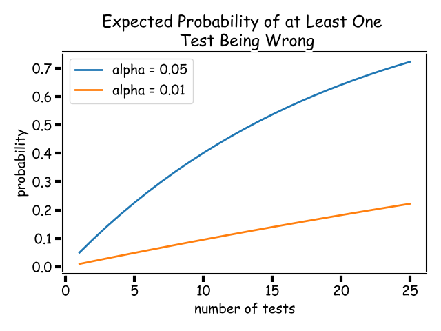
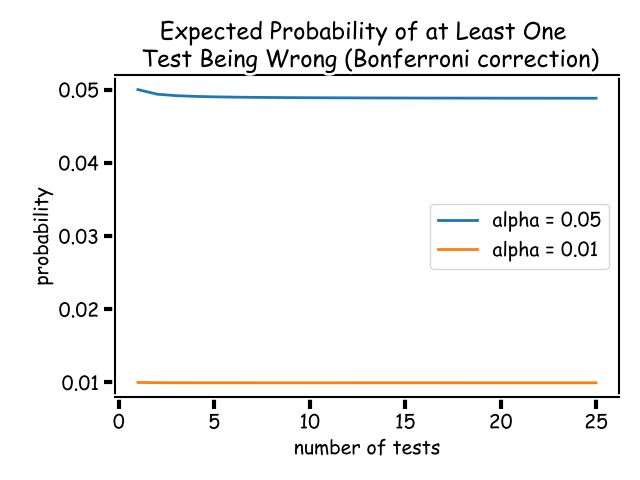
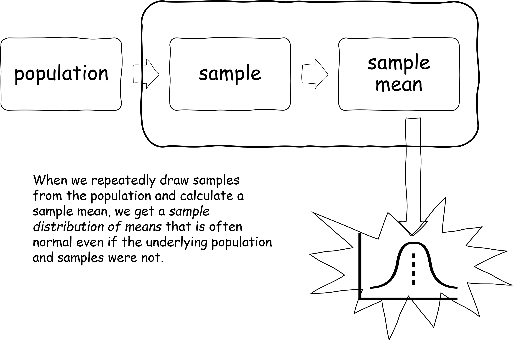
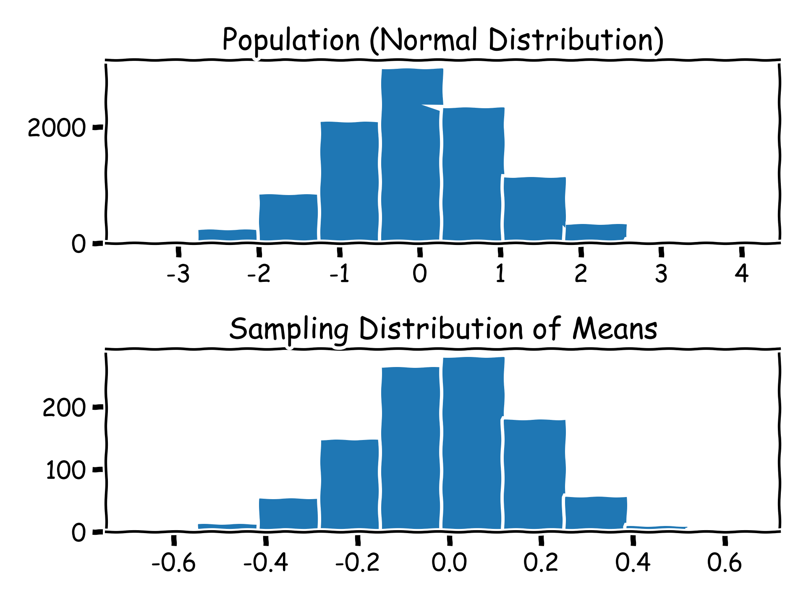
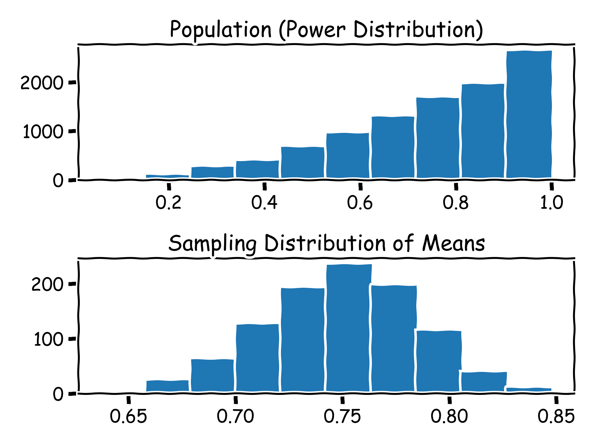
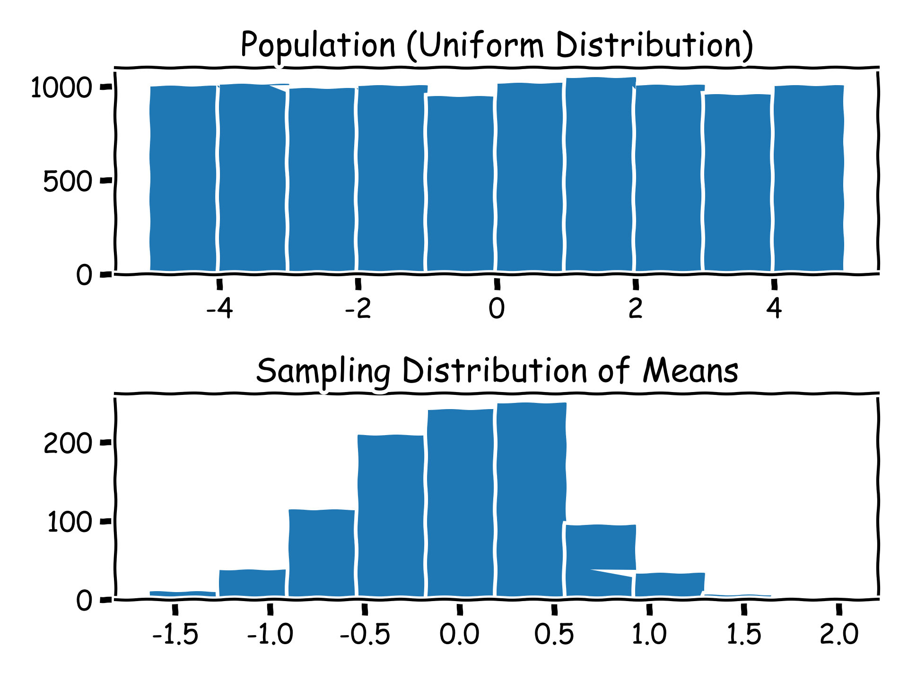
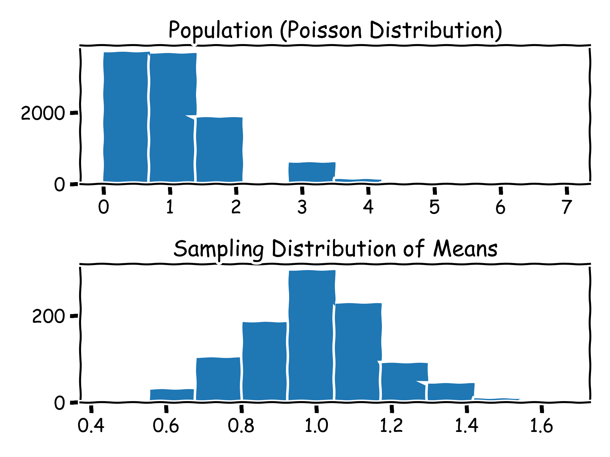
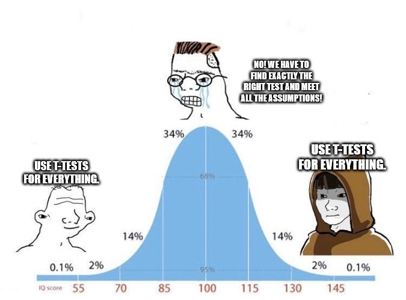

# Lecture 02 -  Frequentist Statistics

> Know the rules well, so you can break them effectively. - the 14th Dalai Lama [^rulesQuote]

[^rulesQuote]: Attributed to the 14th Dalai Lama, but the attribution came from an early 2000s email chain, and the whole quote sounds vaguely like something Picasso and others (might have) said. ¯\\_(ツ)_/¯

Bottom Line Up Front:

* Frequentist statistics gives us a multitude of tools with which to analyze data, even machine learning outcomes
* A bunch of the more common tools are presented here, along with what assumptions they make...
* ... which might not be the assumptions you thought they were making
* $t$-tests likely apply in a lot more situations than you might have thought

---

## Learning Objectives

* Write the null and alternative hypotheses
* Explain when the null hypothesis is accepted or rejected
* Define Type I and Type II errors
* Perform one-sample, two-sample, and paired t-tests
* Explain typical assumptions in parametric statistics
* Perform calculations for effect size and explain the difference between statistical significance and effect size

---

In this lecture, we begin a whirlwind tour of the frequentist side of Statsland, hoping to find the characters and tools that we can take back with us to the world of machine learning.

Unlike most introductory courses in statistics (which I assume many of you will have taken many moons ago), that present a rather idyllic version of Statsland, I should say upfront the region we are entering is an odd county of Mathland due to its long shared border with the Real World. Unlike the purity of the rest of Mathland, the nature (and data) of its Real World neighbor seeps into the practices of the denizens of Statsland, making it inherently somewhat _squishier_ than its mathematical brethren. Statistical tests are built on some underlying principles, that, when taught in many introductory classes, are explained in a somewhat simplified way that forces further, unnecessary assumptions, which we can actually bend or outright break, either because of the underlying principles, or because of the way data occur in the Real World[^real].

[^real]: It appears that the Real World is a bad influence on the citizens of Statsland.

So now, we will learn about some of the more popular tests used in frequentist statistics, the assumptions that you might have been taught and what is underneath them, and when we can break the rules because of the regularities of real-world data, all in a single lecture.

(Note that we'll be covering things at a relatively high level, and many of the definitions and details are in the Math Supplement.)

## Hypothesis Testing

The last lecture argued that the machine learning literature was lacking in hypotheses, and awash in HARKing. Let's take a look at how the world of statistics deals with hypotheses.

We had defined a scientific hypothesis as a proposed, testable explanation for a phenomenon. This definition is fine and good, but perhaps a little too general for what we want to do mathematically in Statsland, which is to _test_ hypotheses. Because of the more specific need, "hypothesis" has a slightly different meaning here:

> ___Statistical Hypothesis___ - a claim or assertion about some parameters of a study.

This statistical definition gives us a finer tool than the broader definition for "scientific" hypothesis with which to do more specific analysis through the lens of _hypothesis testing_.

When testing statistical hypotheses, we consider pairs of opposing claims:

> The ___null hypothesis___, denoted $H_0$ is typically the claim that there _is no difference_ between two or more parameters.

> The ___alternate hypothesis___, denoted $H_a$ is typically the claim that there _is_ a difference between two or more parameters.

We say "typically" here because sometimes the hypotheses are one-sided (or one-tailed), so a null hypothesis might be the claim that a parameter is _not less than_ some value, while the corresponding alternate hypothesis is that it _is_ less than the same value. The same works if you turn the "less than" to "greater than."

|       | One-Tailed Left | One-Tailed Right | Two-Tailed      |
| ----- | --------------- | ---------------- | --------------- |
| $H_0$ | $\theta \leq k$ | $\theta \geq k$  | $\theta = k$    |
| $H_a$ | $\theta > k$    | $\theta < k$     | $\theta \neq k$ |

The hypotheses are stated above for a general parameter $\theta$, which in practice would be something like $\mu$ (the population mean), $\sigma$ (the population standard deviation), and so on. Note that hypotheses are generally stated in terms of the _population_ parameters, while the calculations used for them will generally be done with the _sample_ parameters. We are, after all, performing inferential statistics to try to glean information about the population from the samples.

When dealing with hypotheses, we should remember that we cannot _prove_ the null hypothesis! In communicating our results, we describe the results of our analysis as "supporting the alternate hypothesis" or "not supporting the alternate hypothesis." The other way to say this is whether or not the data allow us to "reject the null hypothesis."

The general flow of a hypothesis test is as follows:

1) State the null and alternate hypothesis as a pair of mutually-exclusive (in)equalities.
2) Compute a _test statistic_ from the data being compared.
3) Find the associated $p$ value.
4) Make the decision to reject or not reject the null hypothesis based on whether $p < \alpha$.
5) Summarize the results.

We'll talk about what each of these means. As a practical matter, 2 and 3 are usually done at once in statistical software, though you need to be sure to choose the right null/alternate pair to begin with, or your results will be very wrong.

### $\alpha$ and Types of Error

The table above shows the four potential outcomes of a hypothesis test, which includes two different types of erroneous decision. Type I and Type II are not terribly descriptive, so we'll put some words to them:

>___Type I Error (False Positive)___ - a rejection of the null hypothesis when it is actually true in the world.

>___Type II Error (False Negative)___ - an acceptance of the null hypothesis when it is actually false in the world.

You'll see that the variable $\alpha$ is associated with the Type I error, and you might have some association of $\alpha$ with the words _significant_ and $p$-_values_ and the number 0.05. Effectively, $\alpha$ is the risk of a false positive that we are assuming with any given test, and importantly, _is a value that we can control_. Scientific tradition sets this value at 0.05 (5\%), but _this is a completely arbitrary value_ and really is up to the discretion of the researcher.

Two common scenarios come to mind when you may want to alter $\alpha$ from its traditional value - multiple comparisons (e.g., if you perform 20 tests and hold $\alpha$ at 0.05, odds are one of them is wrong - discussed below), and practical concerns. There are likely some cases where you want to be a whole lot more sure than 5\% that you're not coming up with a false positive.

Luckily, we have a way around both of those pesky issues, which is to just report the $p$-values directly, rather than generically claiming that they are greater than or less than some $\alpha$.

## $p$-values

Okay, great, so what is a $p$-value again?

> $p$-___value___ - is the measure of the probability of obtaining the observed results, given that the null hypothesis is true.

So when we say that $p$<0.05, we say that there is less than 5\% chance of a false positive. But better yet, we can just say that for some test $p$ = 0.00124 (or whatever your value actually ends up being) because 1) we have computers now rather than tables in the backs of math textbooks and can get pretty precise $p$-values directly, and 2) it gives somewhat more "raw" information to a reader about how you're making a decision about significance.

The $p$-value is a generic measure that is associated with any frequentist test.

As a note, you may hear the term _statistical power_, which is defined as $1-\beta$. This is determined by the size of the effect you are trying to observe, and related to how many samples you need to show such an effect. We won't discuss this part in detail in this course, though we'll mention effect size later.

## $t$-tests

$t$-tests are tests of difference in means, and probably the most common types of statistical tests out there. There are a few different variants that we'll discuss here, and I'm laying the assumptions out in a bit more detail, though as we'll see later, the rules here are somewhat flexible.

The $t$-test uses the $t$ distribution (naturally) to give us values of $p$. The $t$ distribution takes one argument $\nu$, the "degrees of freedom," and approaches the normal distribution as $\nu\rightarrow\infty$ [^dof].

[^dof]: Since the degrees of freedom are tied to the number of samples we have, we also often say that the $t$ distribution approaches the normal distribution as the number of samples $n$ approaches infinity. In statistical practice, $\infty \approx 30$ as a general rule when counting samples and choosing tests, and you can, in theory, start using the normal distribution rather than the $t$ distribution for comparisons of means at that point. But again, you can do that because the two are converging, so it's kind of a moot point.

These tests are common enough to be in any mathematical software from Excel to MATLAB to SciPy, so as a practical matter, you won't need to worry about the equations much (yet). It *is*, however, important to know when you are using each version.

### One-Sample $t$-Tests

This is a test for a difference between the mean of one group and a given value. This test, along with the two-sample equal-variance cases below, are commonly known as _Student's $t$-test_.

Assumptions
* samples are independent and identically distributed
* estimates of the mean are normally distributed
* distributions have unknown variance

>The test statistic $t$ is given by
> $$t = \frac{\bar{X}-\mu}{s/\sqrt{n}} $$
>
>with $\nu = n-1$ degrees of freedom.

If the test statistic above looks a little weird for having a fraction in the denominator - that's because that fraction, $s/\sqrt{n}$ is the _standard error_ (SE), another common estimate of dispersion.

The second assumption listed there is stated slightly differently than what you might commonly see as "the $t$-test assumes normality" (too vague - normality of _what_?) or "the $t$-test assumes normality of the underlying data" (commonly-repeated, actually wrong). We will come back to this difference and the implications shortly.

### Two-Sample Independent $t$-Tests

__Equal variance__

This is a test for a difference in means between two groups, commonly known as the _Student's $t$-test_.

Assumptions
* samples are independent and identically distributed
* estimates of the mean are normally distributed
* the two distributions have the same, unknown variance

>The test statistic $t$ for a two-sample independent test of equal but unknown variance is given by
> $$t = \frac{(\bar{X}_1-\bar{X}_2)-(\mu_1-\mu_2)}{s\sqrt{\frac{1}{n_1}+\frac{1}{n_2}}} $$
>where $s$ is the _pooled_ variance of the two samples,
>$$s=\frac{(n_1-1)s_1^2+(n_2-1)s_2^2}{(n_1-1)+(n_2-1)}$$
>
> This test uses the $t$ distribution with $\nu = (n_1 - 1) + (n_2 - 1)$
>degrees of freedom.

You can see the parallel of the $t$ equation here with the one-sample $t$-test, because ultimately, they're trying to get values on the same distribution.

__Unequal variance__

But what if we don't know that the variance of the two groups is the same? There is actually yet another variant, less well-known, but quite useful, called Welch's $t$-test.

> $$t = \frac{\bar{X}_1-\bar{X}_2}{\sqrt{\frac{s_1^2}{n_1}+\frac{s_2^2}{n_2}}}$$
> where once again $\nu = (n_1-1) + (n_2-1)$.

Assumptions
* _same as above, but distributions do not have to have the same variance_

I don't know that similar variances is a fair assumption in most ML model comparisons (in fact, I strongly suspect the opposite is true), so in many cases, Welch's test turns out to be a better tool than Student's variant.

> Wait, how _do_ we know when variances are the same or not?
>
> There's a test for that! Specifically, the $F$ test for equality of variances. If you want to be thorough, you can perform this test before you make your choice of two-sample $t$-test.
>
> In a parallel to your hypotheses about means, here, your hypotheses would be $H_0: \sigma_1^2=\sigma_2^2$, and $H_a: \sigma_1^2\neq\sigma_2^2$.
>
> The $F$ statistic is quite simple:
> $$F=\frac{s_1^2}{s_2^2}$$
>
> where the $\sigma^2$ values are the population variances, and the $s^2$ values are the sample variances of the two groups. You can obtain a $p$ value from the $F$ distribution in the same way as you do for a $t$ distribution.

### Dependent $t$-Tests

Where independent $t$-tests had us comparing two groups whose individual data points are not directly related to each other, _dependent_ $t$-tests have us examining cases where individual data points _are_ directly related and comparable.

Also, spoiler alert: dependent $t$-tests are actually just one-sample $t$-tests against a mean of 0.

> A grounding example:
>
> Consider the following null hypothesis: _A person's height on their fifteenth birthday is not different from their height on their eighteenth birthday._ You _could_ collect a bunch of data about people's heights at 15 and 18, then treat the two sets of measurements as independent samples, and compare whether they are different from each other as part of an independent $t$-test. But more directly, since you are dealing with individuals, you could also just take each person's height at 18, subtract it from their height at 15, and ask whether that _difference_ is different from zero.

>In this case, the test statistic $t$ takes the same form as the one-sample $t$-test and is given by
> $$t = \frac{\bar{X}_D-\mu_0}{s_D/\sqrt{n}} $$
>
>with $\nu = n-1$ degrees of freedom, $\bar{X}_D$ and $s_D$ are the mean and standard deviation of the differences of the pairs, and $n$ is the number of _pairs_.

While most people's first foray into inferential statistics is the independent $t$-test, in many cases, it is actually the _dependent_ (or _paired_) $t$-test that is better suited to comparisons in machine learning (more on this in the next lecture).

The distinction between using the dependent or independent $t$-test starts to go away as the number of samples increases, but if you find yourself in a situation where 1) the number of samples is relatively small or 2) there may be nontrivial variability in the data between repeated samples, a dependent $t$-test may be a better choice. This might happen, for example, if you have strong class imbalances between repeated samples.

## $z$-tests

You might vaguely recall the $z$ test as something you heard of back in stats class, and then never used in practice. That's likely because the $z$ test is based on the Standard Normal Distribution, which is a normal distribution with a mean of 0 and a standard deviation of 1 (also expressed as $\mathscr{N}(0,1)$). In practice, it ends up being more of pedagogical tool to talk about the normal distribution than anything else because the $t$ distribution approaches the standard normal as the number of samples increases, and the $t$ distribution has the advantage of dealing more properly with lower-sample statistics. Basically, you can cover your bases by using $t$-tests and practically never deal with the $z$ test.

## Multiple test issues and corrections

Having covered a small collection of some of the more prominent members of the statistical testing alphabet, let's move on to the issue of what happens when we perform many of these tests at once.

So far, we've been assuming a "typical" boundary of significance of $\alpha = 0.05$. A clever experimentalist might quickly realize that even if our odds of getting a false positive are 5\%, we could very well get a lot of false positives if we just did a lot of comparisons (and hired more grad students, to do more comparisons, to get better results, to hire more grad students... sound familiar?).[^prosecutor]!

[^prosecutor]: This is also known as the _Prosecutor's Fallacy_.

Let's check:

This situation is less than ideal, and while it may or may not be happening within a specific study, it absolutely is a problem when many people are conducting similar experiments, and only the ones with significant results (statistically or colloquially significant) get published. At a macro level, considering how accessible machine learning research is, and how many people are likely conducting very similar experiments (and how multiple comparison issues, statistical testing, and even dispersion measures are typically ignored in the field), and you get a sense of just how serious the problem is in machine learning[^replication].

[^replication]: Replication crises have already hit psychology and medicine, and Agrawal et al., 2021 (from Lecture 01) shows the tip of the iceberg for Deep RL and how the current benchmark results are practically worthless in light the the methods people are using. Sooner or later the crisis is going to hit machine learning. Fortunately, machine learning has a major advantage in being able to fully control its experiments - and release of data and models is becoming very important. Still, methods tend to be underspecified (e.g. initial random seeds, hyperparameters of "best models," etc). Transparency in data and methods is one side of the equation. Proper statistical methods is another.

What can we do?

While we can't control this issue very well in the field at large, there are very important steps that we can and should take in our own experiments. One of these is the step of multiple comparison corrections.

The usual way to correct for multiple simultaneous tests is by adjusting our $\alpha$ threshold. With that said, much like the family of statistical tests that exist for a given problem, there is a (rather opinionated) family of tests that exists for how to adjust $\alpha$. The most common (and easiest to understand) of these is the Bonferroni correction.

> Bonferroni Correction
>
> $$\alpha_{Bonferroni}=\alpha/n$$
>
> where $n$ is the number of tests being performed.

In order to be considered significant, a test (among the $n$ being performed) must have a $p$ value less than this new $\alpha$. This correction controls the _family-wise error rate_ of these tests.

This type of correction is fairly conservative, meaning it trades Type I error relatively heavily for Type II error, but that is generally fine for small values of $n$ (say, $<10$). When there are many more comparisons being made, the Bonferroni correction is generally seen as being too severe because the threshold for any individual test becomes very low. At that point, a "step-wise" method might be used instead, which considers each $p$ value in either ascending or descending order when deciding a cutoff. We will not be covering these methods in this course, but you should know that they exist (and are common in fields such as genomics) for if you need to seek them out when making many comparisons at once.

The problem of multiple comparisons is rife in the ML literature... or it would be if people were actually properly making statistical comparisons. You can probably imagine how this kind of thing plays out and quickly turns into Grad Student Descent. I have just about never seen these being done in the ML literature, but multiple comparison corrections absolutely should be included in your experiment workflows.

In practice, there is another set of tools that we can use to dramatically reduce the number of pairwise comparisons we make in the first place, which is to perform _omnibus tests_, such as ANOVA, first. We'll talk about what this looks like in Lecture 4.

## Statistical games and choosing the right tests

We've covered a few variants of the most common types of statistical tests, but even for (approximately) the same questions, it can seem like there are a lot of different variants of the same tests. Why? And are there general principles for how to choose tests? And do we always have to precisely choose exactly the right one?

As you may have noticed, different assumptions were made during the mathematical formulation of each type of test. The more specifically we can fit the assumptions of the test to the data we are trying to examine with it, the more we are able to avoid errors in our final results.

> More specifically, we're actually referring to avoiding Type II error. This is called _statistical power_. Remember that avoiding Type I error (incorrect rejection of the null hypothesis) is determined by what we choose as our $\alpha$ value, and therefore something we typically control more easily.

So it would appear that the game we end up playing is just to find the test that meets the assumptions of the data and no more, giving us the most powerful tool with which to answer our question.

One of the key things that I've subtly emphasized in the _assumptions_ sections above is about the "assumption of normality."

In statistics, tests that rely on "an assumption of normality" are very often misconstrued as relying on an assumption of normality _for the samples_ or _for the population_.

_This is not the case._

The assumption of normality is that the _sampling distribution of the estimate of the parameter of interest_ is normally distributed, which for the $t$-test, is the _mean_. 

Many of these words sound alike, making this a little confusing. The _sample_ is a subset of the _population_. The _estimate of the mean_ is a single value... but if we were to get a new sample from the population and calculate a new sample mean, we'd have a different value. Do it again, and again, and again, and you start to have a _sampling distribution of the estimate of the mean_ which is, as the name implies, a distribution! It is _this_ distribution that must be assumed to be normal.

> Central Limit Theorem
>
> If you have a population with mean $\mu$ and standard deviation $\sigma$ and take sufficiently large random samples from the population _with replacement_, then the distribution of the sample means will be approximately normally distributed. This will hold true regardless of whether the source population is normal or skewed, provided the sample size is sufficiently large. [^clt]

[^clt]: There are actually several more precise (and actually different variants) of the Central Limit Theorem. This statement, however, should serve us well enough for this context.

What the CLT does for us is vastly expand to kinds of data and settings under which we can use powerful parametric tests[^NormanAndHarpe]. Does your sample not actually follow the normal distribution? No problem! Is your data ordinal (ordered categories) and not ratio (differences between measurements, along with a true zero)? Go right ahead!

> ___Parametric Statistics___ refers to statistical methods that assume an underlying distribution (nearly always the normal distribution).

Just to show you some empirical results, the following are a set of population distributions, including one that is actually normal and several that are not. The histograms that follow them are their sample means. Tests of normality for _every single one of them_ failed to reject the null hypothesis that the sample means were normally distributed.

[^NormanAndHarpe]: See Norman, Geoff. "Likert scales, levels of measurement and the “laws” of statistics." Advances in health sciences education 15.5 (2010): 625-632. and Harpe, Spencer E. "How to analyze Likert and other rating scale data." Currents in pharmacy teaching and learning 7.6 (2015): 836-850. Both of these papers are specifically examining issues of robustness around Likert scale data (ordinal rating scales commonly used in the psychological literature). But 1) their arguments are actually more general than Likert data, and 2) even if they weren't, because of the ordering of data types (ordinal being more restrictive than ratio and interval (see Math Supplement)), their arguments also apply quite well to some of the issues we see in many other types of experiments, including for machine learning.

This robustness occurs because the CLT holds in most cases _regardless of the original distribution of the random variables_. As a theorem about limits, it also becomes more powerful the more samples we have, so the more samples we have, the more we can ignore certain test assumptions. Robustness is often difficult to assess analytically, so you'll find that a lot of the studies about this kind of problem ("How robust is X test to Y kind of violation?") is done empirically with simulation studies.

The results above came from underlying populations of 10,000 members, and sampled groups of 30 from them 1,000 times to generate a distribution of 1,000 mean values. Now, how large your sample groups need to be (corresponding to the number of _replicates_ of your experiment) in order for this convergence of the mean distribution to normality to happen _does_ depend on what the underlying population distribution looks like, but in many cases, is much smaller than you might think. Norman (2010) shows that in many cases, it can be as small as 5-10 samples per group. 

Note that this tendency is true because we are talking about tests of _means_, and does _not_ hold for tests of medians because the sampling distribution of the estimate of medians is _not_ normal.

The game we actually end up playing when testing about means is to first assess how much data we have, to give us a sense of how much we can "get away with," and _then_ find the test that is robust to what we _can't_ get away with, giving us the most powerful tool with which to answer our question. This game is much squishier than our original one, and leaves room for debate - quite unusual in Mathland - and indeed, there is a fair amount of debate about this kind of thing in Statsland. When we have the general category of test in mind, our more specific choices here are often informed by looking at robustness studies in the literature, though ML practitioners are perhaps used to such squishiness.

<!-- 

(Don't actually blindly use $t$-tests for everything. You should actually try to minimize the number of assumptions you're bending, and know when you're bending them. And there are definitely some caveats, like multiple comparisons, that we do need to pay attention to. $t$-tests also only work for comparisons between two groups - if you're doing more than that, you need ANOVA, which fortunately also benefits from all the arguments we're making here about robustness.) -->

As an aside, there is actually also a fair amount of leeway with regards to the accuracy of the two-sample $t$-test when the two variances are not the same [^Posten84]. This is a case where the test is actually just more robust to a strict violation of its assumptions. It is actually much more important that the number of samples in each group is roughly equal. All of these are judgement calls. Either way - look at the data, try to make sure your group sizes are roughly equal, and know that Welch's test is there, but you have a certain amount of leeway in your decision-making.

[^Posten84]: Posten, Harry O. "Robustness of the two-sample t-test." Robustness of statistical methods and nonparametric statistics. Springer, Dordrecht, 1984. 92-99.

> _When you head out to break the law..._
>
> As a very practical matter for researchers: if you do choose to use a parametric test in a situation where some (real or popularly but improperly made) assumption is rather obviously violated (but that you know is probably okay because of this discussion and because you also did your homework and read the underlying papers (right?)), you should cite the underlying papers (provided in the footnotes, and/or you can look up "robustness of X test to Y violation" to check for your specific case) and explicitly call them out as justification in the text.
>
>Presently, it seems that most reviewers (in many experimentalist fields) are trained in the more idyllic/pedantic form of traditional statistics (if they are trained in statistics at all), where all the rules are followed, which sometimes includes rules that aren't actually there.
>
>If you're gonna break the law, better bring backup.

## Categorical tests

Everything that we have discussed so far assumes an underlying normal distribution of a continuous-valued sample statistic. There are other parametric tests that do not rely on an underlying normal distribution, nor on contiuous data (or data that we can treat as continuous). The most common of these in machine learning is the $\chi^2$ test, used when the data in question are categorical, such as when we are dealing with classification problems.

Now there are two ways that one may deal with classification outcomes: as aggregate accuracies (and associated precision and recall rates), or as raw counts (confusion matrices and contingency tables) and individual correct/incorrect decisions.

Accuracies can generally be treated as continuous values and dealt with using the methods we've already described, but counts and individual correct/incorrect predictions require the use of methods that do not assume an underlying normal, such as $\chi^2$ and logistic regression tests[^chiSquared]. This is just a point of awareness brought up because of its relevance to classification problems, but not something we will cover in this course.

[^chiSquared]: You may sometimes see the $\chi^2$ test referred to as nonparametric because it is one of the few tests that people tend to encounter in introductory stats that does not assume normality. I feel that this is an incorrect characterization because it uses an incorrect definition of _parametric_.

## Nonparametrics

### Nonparametric Tests

In the fringes of Statsland, beyond the orderly neighborhoods of the various distributions and their associated tests, lies the domain of the nonparametrics. These extended family members of our more prominent Statslanders include entities such as the Mann-Whitney U test (the nonparametric equivalent of the independent $t$-test), the Wilcoxon Signed Rank test (the nonparametric equivalent of the paired $t$-test), and the Kruskal-Wallis test (the nonparametric equivalent of the one-way ANOVA), among others. These tests do not assume _any_ underlying distribution, and instead rely mostly on signs or ranks in the data.

Relatively speaking, nonparametric tests are more conservative (less likely to reject the null) than their parametric counterparts - they have to be given how little they are assuming about the data being examined. Given the higher risk of Type II error and the discussion above about the robustness of parametric tests, the only real remaining reasons to use these tests is if your sample size is very small indeed, which increases the risk that the means you are calculating are not normally distributed (disallowing the invocation of the Central Limit Theorem) [^space]. But if your sample sizes are that small, consider that even if the statistics work out, you may very well have concerns about whether or not your data are representative of the population[^drl].

[^space]: One of the areas that relies more heavily on nonparametrics has been bioastronautics because the sample size of what you could do in the way of human (astronaut) experiments on Skylab and Mir tended to be about $n=4$. That might change in the coming decades though.

[^drl]: Looking at you, deep RL. That said, there are actually a few different ways that "replicates" or "samples" happen in RL, and the counts for these can be very large (e.g. training episodes) or very small (e.g. model initializations). We'll talk about these in the next lecture.

Given their conservative nature, if a nonparametric test does return a rejection of the null, you can be sure that the parametric equivalent will do the same.

### Bootstrap Procedures

There are also nonparametric methods involving _bootstrap_ procedures. These are not tests, but rather, are a set of resampling-based procedures to _simulate_ the execution of many tests and subsequent estimation of statistical parameters. Essentially, they ask the question "if I were to perform this experiment many times and estimate the parameters of interest, what would the dispersion of the parameter estimates look like?"

There are some recommendations [^Agarwal21] that stratified bootstrap confidence intervals be used for few-run RL scenarios, particularly for multi-task cases. However, given the novelty of these methods for the ML space, and the lack of analytical backing, I am unsure of whether to recommend them, and in which scenarios they ought to be used (particularly outside RL).

[^Agarwal21]: Agarwal, Rishabh, et al. "Deep reinforcement learning at the edge of the statistical precipice." Advances in neural information processing systems 34 (2021): 29304-29320.

## Effect Sizes

When used on a comparison of two parameters (often means), $p$ values tell us whether or not there is a detectable difference. If $p<\alpha$, we call a result _significant_. The language here is a little tricky, because _significant_ has certain connotations in typical usage. It is important to remember that $p$ values do not tell us _how much_ of a difference there is between the parameters, just that there is a detectable difference. To give us a sense of _how much_ of a difference there is - often closer to what we think of as being operationally relevant, we need to use the _effect size_.

One of the most common ways to calculate an effect size is using Cohen's $d$:

$$d=\frac{|m_1-m_2|}{s},$$

where $m_1$ and $m_2$ are the two sample means, and $s$ is the _pooled_ standard deviation of _both_ sets of samples. Cohen's $d$ effectively asks the question, _"how different are the central values of these two samples in comparison to how much variability is already present in the two samples?"_ You can see this in the structure of the equation, which, like many test statistics, can be viewed as signal (differences in means) over noise (pooled standard deviation). For example, if $d = 2$, then the difference in the means is two full (pooled) standard deviations away. How important that is, of course, depends on the setting, but generally speaking, that's a pretty big difference, and the difference should not only be detectable (have $p<0.05$), but be operationally relevant![^clinicalSignificance]

[^clinicalSignificance]: In case you wanted even more similar-sounding terms, in medicine, effect size is often one of the indicators of the "clinical" or "practical" significance of a treatment. Neither of these is the same as statistical significance.

## Where in the world is Thomas Bayes?

This course covers frequentist statistical methods, but not Bayesian approaches. Bayesian statistics are centered around the idea of _degrees of belief_ and prior probabilities, as opposed to the frequentist view of attempting to converge on probabilities as the number of samples increases. Each has its own sets of pros and cons. Briefly, we are not covering Bayesian statistics here for the following reasons:

* this is a short course
* many of the ML-specific corrections to statistical approaches developed over the past two decades (that are covered in the next lecture) have frequentist underpinnings (though there are likely Bayesian applications that are not too different)
* I am primarily a frequentist by training and practice, and am not currently confident in presenting the cross-section of Bayesian statistics and machine learning as far as ML-specific workflow issues

These factors may change in future iterations of this course, and a Bayesian update is not out of the question!
