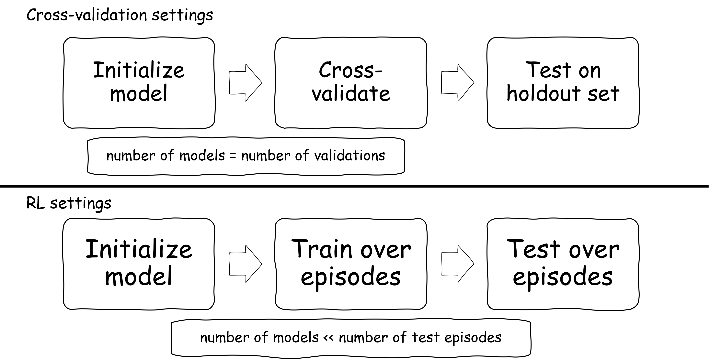

# Lecture 03 - Machine Learning Specifics

>Changing random stuff until your program works is "hacky" and "bad coding practice" but if you do it fast enough it's "Machine Learning" and pays 4x your current salary. - Steve Maine (via Twitter)

"Changing random stuff" in ML typically has two components. There's the part where you do stochastic gradient descent, which, while stochastic, can at least just be considered an optimization procedure. The part where you "change random stuff" in model hyperparameters and test procedures, however, has more to do with design of experiments and data analysis, and is the focus of this and the next lecture.

---
## Learning Objectives

* Describe common methods in general design of controlled experiments, and compare these to machine learning workflows

* Describe violations of typical statistical assumptions in typical machine learning workflows

* Identify machine learning experiment designs that alleviate these violations, including repeated measures and statistical corrections

---

Bottom Line Up Front:

* Machine learning workflows often violate some principles of statistical analysis

* Depending on the type and severity of the violation, it may or may not be terrible for the correctness of your statistical results

* Oftentimes, there are minor mathematical tweaks to your post-experiment calculations that can make your statistical results more correct

* Oftentimes, there are also minor, and not-so-minor procedural tweaks to your experiment design that can make your statistical results more correct

---

## A Typical ML Workflow

As far as I can ascertain, a typical machine learning workflow looks something like this:

1. Gather data
2. Explore data
3. Data pre-processing
4. Choose a model type and architecture[^foundation]
5. Train model
6. Evaluate model
7. Deploy to production
8. Monitor and update

[^foundation]: Or, nowadays, perhaps a foundation model.

In this lecture, we're going to be focusing on the training and evaluation steps.

In training and evaluation, we want to obtain some information about the performance of our models given the data that we have. I'll describe these briefly here so that we're all on the same page.

Standard procedure in supervised and unsupervised learning would have us divide up our data into train, validation, and test sets, likely through some kind of cross-validation procedure. Alternatively, if you're training up something very, very large, then you may find yourself using a combination of [un,self-,semi-,<null\>]supervised learning, building a _one_ model, and then performing tests with it.

Standard procedure in reinforcement learning is to train different models under different independent variables for some feature of the model or training process, evaluate a few different seeds for training runs (often 3-5), and then evaluate performance for some number of episodes for each trained model.

It is important at this point to cast what we're talking about in experimentalist terms. In contrast to definitions from last lecture, these definitions are provided for the machine learning context.

> ___Independent Variables___ are the experimental parameters that we are manipulating. These might be model architectures, pretraining procedures, feature ablations, and the like. Typically, these are treated as categorical variables, but in rare cases, they might be ratio.

> ___Dependent Variables___ are the experimental outcomes that we are measuring. These include accuracy, precision, recall, error under some distance metric, silhouette score, game score, and the like.

> ___Replicates___ are repeated experiment runs under the same settings (factor levels) of independent variables, with the idea that they are subject to the same sources of variability, but independent of each other. Multiple runs of the same model/training/etc settings using different initial seeds in RL is a replication procedure. K-fold cross-validation is _close to, but not quite_ a replication procedure.

With those definitions out of the way, and our tour of (frequentist) Statsland in mind, let's look at some of the issues that happen when one tries to use statistical methods to analyze ML model performance. Because there is not exactly a one-to-one mapping between issues and remedies, we'll present a collection of issues first, and then talk about how certain remedies map to them.

## Statistical issues in machine learning workflows

### ___1) Not reporting uncertainties___

See Lecture 01. But also, if you report variances or standard deviations calculated the usual way with almost any flavor of cross-validation, it's almost certainly not what you think it is because...

### ___2) Cross-validation violates sample independence___

In typical K-fold cross-validation, we split our data into $K$ blocks, train a model on all but one held-out block, test on the held-out block, and repeat with each block as the held-out component until we have $K$ models with $K$ associated performance metrics. Oftentimes, $K$ is in the range of 5-10.

Mean scores are then reported as

$$\bar{X}=\frac{1}{K}\sum_{k=1,...K}^{K} \mathscr{L}(\theta_{k},D_{\backslash k})$$

where $\theta_k$ is the $k^{th}$ model, trained in $D_{\backslash k}$, the dataset without the $k^{th}$ block of data. That should make it fairly obvious that apart from the case of $k=2$, the models are hardly independent, making these not true replicates!

In fact, if we were to just reach for our typical $t$-tests, the Type I (incorrect rejection of the null) error rate would be higher than what it should be, and unacceptably high, particularly if we were to use random subsample cross-validation[^Dietterich98]. 

[^Dietterich98]: Dietterich, Thomas G. "Approximate statistical tests for comparing supervised classification learning algorithms." Neural computation 10.7 (1998): 1895-1923.

It turns out that this inflated Type I error rate is because typical estimates of variance underestimate the actual variance in K-fold cross-validation, which has contributions from our double-dipping of the data in training and validation[^extraTerms]. Worse, these extra terms can be of the same order of magnitude as the actual variance we are after. Worst news of all: _there is in fact no unbiased estimator for the variance of a K-fold cross-validation_[^Bengio03].

[^extraTerms]: Specifically, there are two extra terms caused by within- and between-block covariance.

[^Bengio03]: Bengio, Yoshua, and Yves Grandvalet. "No unbiased estimator of the variance of k-fold cross-validation." Advances in Neural Information Processing Systems 16 (2003).

But by now you should be suspicious. This is a _theoretical_ claim, and we spent a bunch of time talking about how theory and practice are a ways away from each other in Statsland. So what happens in practice, and are there things we can do be be better even if we can't be perfect?

Although we had previously talked about the various ways in which the Central Limit Theorem saves us from statistical violations, nothing in the CLT helps with dependence between samples.

But even that aside, luckily, this problem has also been studied, both analytically and empirically. Even more fortunately, more than one study has converged on similar recommendations, which we'll get to shortly. 

### ___3) Too few replicates___

The notion of "sampling" is a rather overloaded term when we're at this intersection of contemporary machine learning and statistics. In general, we're interested in "random sampling," where we're holding constant some of the things that we care about, and getting multiple measurements from "inherently" random process[^\uncertainty].

[^\uncertainty]: In uncertainty terms, the things a model _could_ consider but perhaps didn't, fall under the umbrella of _epistemic uncertainty_, while the "inherently" random processes in measurement from things that we cannot model fall under the umbrella of _aleatoric uncertainty_. The former is reducible via better modeling, the latter is irreducible. Disentangling the two, especially in ML, is an active area of research.

Repeatedly random sampling of the same controlled conditions is typically what statistics calls "replicates" of an experiment, but in ML workflows, there are at least two categories of places where replications can happen:

1) Random sampling of the model space via random initializations
2) Random selection of training, validation, and test samples

The number of replicates in the model space can vary wildly, depending on the training cost, from hundreds or thousands in the case of "automatic tuning" systems, to a handful of runs in deep reinforcement learning[^drl], to essentially single instances for large language (and other foundation) models.

[^drl]: As we saw in Lecture 01.

The number of replicates in validation and test tend to report 5 to 20 (in the case of cross-validation) or 1 (in the case of test) performance values, but because these values are at least built on multiple samples in those sets, one can argue that the replication numbers here are much higher. However, that assumes that your model didn't simply "get lucky" with a particular train/validation/test split.

When the number of replicates becomes very small, not only do our statistical methods start to fail us[^robustness], but we start to also be concerned about _ecological validity_.

[^robustness]: Though Norman (2010)'s experiments show that the tests themselves are quite robust down to even ~5 replicates per group.

> ___Ecological Validity___ is the judgement of whether a study's conclusions generalize "outside of the lab."

Even though the _tests_ themselves may still work, whether your (small) sample appropriately represents the real world becomes a much greater concern. This is a pretty squishy thing to try to answer, and is heavily context-dependent, both on the level of an individual study, as well as the general expectations of a particular field.

### ___4) Conflating model performance with method performance___

This is a problem that is very closely related to the previous issue. Generally speaking, there are two kinds of ML papers:

1) "We've developed a model to produce Awesome, and you can use it too! Here's the model!" (Example: ChatGPT[^website])

2) "We've developed a general method to improve the way you train machine learning models to produce Awesome! Our instances of the models aren't the point, but the method is, and you should use it!" (Example: convolutional layers)

[^website]: Or at least, "Here's a website/API where you can interact with it while we keep it under wraps because it's valuable and/or dangerous. We might also change what's behind the scenes sometimes. We might tell you if we do that, we might not. Also, thanks for the data."

If a paper's claims are about a _model_, then the focus of the analysis can be restricted to replicates arising from the random selection of the test set.

If a paper's claims are about a _method_ to improve model-building, then the focus needs to be on _both_ the random sampling of models _and_ the random sampling of train/validation/test data.

Problem is, this distinction often gets muddled (because who needs hypotheses?), and the focus of the post-model-building data analysis similarly gets muddled. The ResNet paper[^He15] is a great example of a paper that I feel gets really close to a proper experimental setup (and hypotheses!) to tease apart a number of architecture and training effects, and presents a reasonably convincing argument about its advocated method. But ultimately, it doesn't do so in a proper experimental framework, particularly around the issue of replicates and uncertainty quantification.

[^He15]: He, Kaiming, et al. "Deep residual learning for image recognition." Proceedings of the IEEE conference on computer vision and pattern recognition. 2016.

### ___5) Not controlling train/test splits in cross-validation comparisons___

In ML, we are typically after some performance metric that is dependent on both the model being trained, and the data on which it is trained ($\mathscr{L}=f(\theta,D$)). We often implicitly think of the data as being constant - but we rarely make it so, even when we can! Instead, we just rely on some cross-validation scheme that is _not_ matched between models under consideration.

Consider the case of $k$ validation sets $d \in \{d_1, d_2,... d_k\}$. Under a typical ML workflow, we'll generate $k$ cross-validation sets when using one model, and then use some other $k$ sets when using another. This leads us to use independent tests of two or more groups. This isn't necessarily a problem when the number of samples ($k$) is large, but starts to be when it isn't, or when certain folds contain particularly unusual data or data splits for whatever reason.

## Statistical remedies for machine learning workflows

_I haven't figured out a good way to do proper citations in raw(-ish) Markdown yet, and I feel that they're pretty necessary here, so citations in this section will be raw and appended at the end._

Because Statsland is squishy, the remedies here are not commandments of _thou shalt do all these things_ (except maybe the use of hypotheses). They are recommendations. They may be used in isolation or in combination, and we'll discuss how they interact if there is literature about it.

### ___Control train/test splits in cross-validation comparisons___ (applies to 5)

We can address 5 quite quickly. In computer-based experiments, we effectively have full control of our initial settings, and can repeat the _exact_ same starting conditions for different model training regimes. That means that we have a significant advantage over your typical physical experimentalist in that we can almost always _directly pair comparisons_ by holding the variables constant - the most relevant of these often being the training and validation data.

Instead of generating $k$ cross-validation sets when evaluating one model, and then use some other $k$ sets when evaluating another, why not generate a _single_ collection of $k$ cross-validation sets, and use them for _all_ models? That way, cross-validation $i$ for one model is _directly_ comparable to the same cross-validation index for another, because it was trained and validated _on the same data_![^sgdBatches] At this point, we can use _dependent_ testing, to _directly_ look at differences between model performance.

This change is fairly trivial to implement, and allows you to control for irregularities caused by any particularly "bad" or unusual data in a given training/test split.

[^sgdBatches]: To be really, really sure, you could also match batches of data between model trainings in stochastic gradient descent, and control other parameters as well. However, given that training is unlikely to converge after exactly the same number of batches (which I suppose you could also control), I suspect that this level of control quickly starts to give minimal return, especially in comparison to controlling for training and validation data.

### ___State your hypotheses and use hypothesis testing___ (applies to 1, 3, and 4)

Just following the workflow of the last lecture will get you pretty far. The ideas of presenting uncertainties, how many replicates you need, and where to focus your attention for sampling and data analysis simply come as a consequence of standard statistical practice. There is no ML-specific magic here.

### ___Repeated cross-validation___ (applies to 1 and 2)

Okay, ML-specific magic. Here, the idea is to do a cross-validation procedure once (giving, say $K$ results), and then throw everything back into the pot, resample, and do it again, and again, for a total of $r$ times, giving a total of $r\cdot K$ results. 

Specifically, $K$-fold cross-validation is strongly recommended over leave-one-out or repeated subsampling, because the latter two procedures have much more overlap in the training set (both) and test set (repeated subsampling). $K$-fold cross-validation at least guarantees that your test sets are independent.

There is agreement here between Nadeau and Bengio (1999), Bouckaert and Frank (2004), and Rodriguez et al. (2010), that repeated cross-validation is a good experimental method to drive the estimate of the variance closer to the true variance of the generalization error. 5x10 (meaning 5 resampled replicates of 10-fold cross-validation) and 10x10 procedures are recommended.[^cry]

[^cry]: At this point, many ML engineers are crying, and supercomputing staff are opening bottles of champagne.

> ___Do cross-validation, put everything back, resample, and do it again.___ 5 or 10 repetitions on a 10-fold CV have been shown to be good, but doing any number of replicates is going to be better than just doing a single pass of cross-validation.

### ___Nadeau-Bengio correction___ (applies to 1 and 2)

This is a a chain of corrections to the way we present errors and conduct $t$-tests, presented in Nadeau and Bengio (1999)[^the90s]. The reason I'm going into a bit more detail here, and less so in the next (nonparametrics) section is so we can focus the course's more detailed examples on on parametric methods, and also because I do not believe that these corrections are currently built into standard statistical packages (the nonparametrics largely are).

[^the90s]: Yes, really, a machine learning result from the 90s

First, and fortunately for us, Nadeau and Bengio found that cross-validation _does_ in fact give an unbiased estimator for the mean. In the repeated cross-validation case, we have

> Mean generalization error
> $${}^{n_2}_{n_1}\hat{\mu}_{r\cdot K} = \frac{1}{r} \sum_{r=1}^R (\frac{1}{K}\sum_{k=1}^K x_k)$$
>
> where $r$ is again the number of replicates, $\hat{\mu}_r$ is the mean error of the $r$th replicate of cross-validation, $n_1$ is the size of the training set, $n_2$ is the size of the test set in each cross-validation, and $x$ is the value of interest (e.g. accuracy, score, etc).

<!-- If you're checking these notes and wondering why there is an empty set of curly braces {} followed by subscripts and superscripts, it's because those are pre-variable sub/superscripts, and an empty set of curly braces was the hacky way to display that. -->

It's the variance that gives us trouble. We noted earlier that this is a biased value due to the sample dependence and that no unbiased estimator exists for it. Nadeau and Bengio give us two solutions (though we'll just be focusing on one of them here[^conservative]).

[^conservative]: The other is a more conservative version of what we present here, which, unlike what we are presenting, does not appear to have as much testing from other researchers in the literature.

Through some approximations of intermediate variables that we won't get into here, a better approximation of the generalization variance can be given as

> Generalization Variance
> $$\hat{\sigma}^2 = \Bigl( \frac{1}{r \cdot K} + \frac{n_2}{n_1} \Bigr)\tilde{\sigma}^2$$
>
> where $\tilde{\sigma}$ is the sample variance of the errors.

From the equation above, you can see what the impact of replicates is on the generalization variance, alongside the choice of $K$ in cross-validation[^crossvalidation].

[^crossvalidation]: The original Nadeau and Bengio paper actually dealt with a "general" case of cross-validation, inclusive of procedures like repeated subsampling, rather than just the special case of $K$-fold cross-validation. In that paper, they used a general denominator $J$ in place of our $r \cdot K$ term, for the number of _overall_ replicates (counting each fold in a $K$-fold procedure as a replicate). The $r\cdot K$ form can be seen in Bouckaert and Frank, 2004, which tests the Nadeau-Bengio correction specifically in the repeated $K$-fold cross-validation setting.

Now we have traction on a corrected $t$-test! Say we're using the paired $t$-test procedure that we previously described, then we have:

> Mean generalization error _difference_
> $$\hat{d} = \frac{1}{r} \sum_{r=1}^R (\frac{1}{K}\sum_{k=1}^K d_k)$$
>
> taking the same form as the mean generalization error, but where $\bar{d}_j$ is the difference in the $j$th _paired_ performance metrics.
>
> And the corrected resampled $t$ becomes
> $$t = \frac{\hat{d}_J}{\hat{\sigma}^2}$$
> with $r\cdot K-1$ degrees of freedom.

Clearly, this is a procedure that is meant to be used with repeated cross-validation, but note that this procedure still works if you didn't actually do that: your $r$ would just be 1. Also, the authors note that the approximations they made along the way make this a more conservative test, but argue that that is preferable given the liberal nature of the way most of ML has been doing statistics [^statistics].

[^statistics]: That's part of how you can tell this was a paper from the 1999 - they could make this argument because the ML crowd still regularly did $t$-tests back then. However, I think the "conservative is preferable" argument here still holds in the early 2020s given the current rather liberal use of (non-statistical) comparisons in the ML literature.

So, to review, the Nadeau-Bengio corrections give us 1) the original mean value that we expected, 2) a correction for the variance, that you can use to derive a standard deviation for your plots, and 3) a corrected $t$ statistic based on the new variance.

I only show the paired $t$ test statistic here, but the independent cases are analogous if for some reason you didn't do the paired procedure.

Here, there is agreement between Nadeau and Bengio (1999) and Bouckaert and Frank (2004) that 5x10 or 10x10 repeated cross-validations should be used _in conjunction with_ the corrected $t$-tests for best results, but again, they can still be used separately and are a "to the best of your ability" kind of thing given the circumstances of your experiment [^noCheck].

[^noCheck]: Rodriguez et al. did not evaluate the corrected $t$-test in their paper.

### ___Nonparametric methods___ (applies to 3, maybe 4)

If you find yourself in a situation where you only have a handful of samples (perhaps because they are very expensive to obtain), the samples are ordinal with four or fewer levels, or the outcomes are ranks, you may reach the point where it is appropriate to use a nonparametric test. I admit I am not sure where the latter two might come up in ML.

We are not covering nonparametric methods in this course. Per the previous lecture, for your awareness, the following equivalencies exist:

|Nonparametric Test | Parametric Equivalent |
|-----|-----|
|Mann-Whitney U test | independent $t$-test|
|Wilcoxon Signed Rank test | paired $t$-test|
|Kruskal-Wallis test | one-way ANOVA |
|N/A | N-way ANOVA |

(We cover ANOVA briefly in this course in the next lecture.)

Nonparametric methods are less powerful (more prone to Type II error) than their parametric counterparts, and are more restricted in the kinds of experimental setups they cover.

### ___More replicates on the subject of interest___ (applies to 3 and 4)

If you want to make claims about training methodology, know that you really have to have more than 2-5 training runs to show it. Run more models.

> Run more models. That's it. That's the recommendation.

Also, if you decide to try your independent across a pool of runs where some _other_ variable is being changed to show that "on the whole, it works," it is likely not a good idea to just compare the single independent variable[^Hu2020], because now you've introduced _new_ independent variables that you need to account for, and there may very well be new dominant effects from other variables, or multi-variable interaction effects. Welcome to the _Hotelling $T^2$_, _n-way ANOVA_, or _mixed effects regression_ territory. We will not be covering these here.

[^Hu2020]: As seen in the AI-only Hanabi evaluations for Hu, Hengyuan, et al. "“Other-Play” for Zero-Shot Coordination." International Conference on Machine Learning. PMLR, 2020.

<!-- ### ___Bootstrap confidence intervals___ (applies to 3 and 4)

Let's say you're trying to show the efficacy of a new _method_ of doing machine learning; the method is being used in a setting where individual training runs are expensive, but once trained, inference is inexpensive (as one would hope). Bootstrapping[^bootstrap] helps us with that 

[^bootstrap]: As in, pulling yourself up by your bootstraps.

TODO - over multiple tasks -->

## ___Communicate your methods___

One final strong recommendation across the board: be clear in reporting your methodology, note any reasoning you had about your choice of analysis path, and any caveats that remain, or known biases in certain tests.

If you're in situation 3 and/or 4 where you want to make claims about training methodology, but find yourself in a setting where you only have a few training runs, it may be more proper to consider what you're doing a case study and show the performance distribution of individual runs than to make broad claims that you can't back up well (because your training runs may just have been lucky).

Also, if you do use error bars of any kind, you need to say what they represent. Error bars are often used for both standard deviation and standard error, not to mention any corrections you might have on either. It's best practice to note what they mean on the first figure in which they appear.

If you're choosing a particular experimental setup because of a statistical analysis plan, first, good job - now you're thinking like a proper experimentalist, second, explain your choice, because frankly, much of the ML field is probably unfamiliar with actually performing statistical analysis on model performance before making claims.

You will likely not be able to implement all the latest and greatest recommendations in high-quality estimators out there, not least of which may be because 10x10 repeated cross-validation would put you three months past the due date of your work (among other reasons), but in those cases, be clear about what the limitations and potential biases exist in your estimators and tests. You can still _do_ your tests, mind you, the math still works, but acknowledging any inflated errors one way or another will go a long way towards making your work more honest.

## Where does hyperparameter tuning come in?

Hyperparameter tuning is a step in deep learning workflows that I have thus far mostly ignored. It introduces nontrivial variability into the training of models by optimizing over a set training values at some point before you actually "start" your experiment. Even replicates of experiments (typically via random seeding before training) is likely done after hyperparameters have been set. It is not entirely clear to me what the best approach is to balance this step against the demands of experimental control.

On one hand, one might conduct hyperparameter tuning broadly across whatever independent variables you are actually trying to experiment on, and then use the same hyperparameters for all models. However, there may be a concern that for different settings of your independent variables, different hyperparameters might result in better models, giving some of the "competing" models an advantage.

A more common approach (I believe), is to tune hyperparameters on a per-independent-variable-set (actually per-_treatment_, covered next lecture) basis. This leads to hyperparameters being variables that do certainly affect your ML models, but which are not considered as part of your statistical analysis. A potential way around this, which works well with the existing statistical workflow, is to simply consider different models (using their best-trained cases post-hyperparameter-tuning) as _categorical_ variables. This approach is likely the one that people would arrive at first anyhow, but I bring it up just as a point of caution against treating differently-tuned models as interval/ratio-related to each other via their hyperparameters.

The hope is that hyperparameter tuning is _not_ more of a driving factor in your results than whatever independent variable you were actually checking, though the risk certainly remains. More likely than not, a more detailed analysis of such parameters would be left to ablation studies - which are expensive, but obviously much more thorough and much more amenable to fully controlling the experimental conditions.

### Citations for this section

Agarwal, Rishabh, et al. "Deep reinforcement learning at the edge of the statistical precipice." Advances in neural information processing systems 34 (2021): 29304-29320.

Bouckaert, Remco R., and Eibe Frank. "Evaluating the replicability of significance tests for comparing learning algorithms." Pacific-Asia conference on knowledge discovery and data mining. Springer, Berlin, Heidelberg, 2004.

Nadeau, Claude, and Yoshua Bengio. "Inference for the generalization error." Advances in neural information processing systems 12 (1999). 

Nadeau, Claude, and Yoshua Bengio. Inference for the Generalization Error. No. 99s-25. CIRANO, 1999.

Rodriguez, Juan D., Aritz Perez, and Jose A. Lozano. "Sensitivity analysis of k-fold cross validation in prediction error estimation." IEEE transactions on pattern analysis and machine intelligence 32.3 (2009): 569-575.

Note that there are two Nadeau and Bengio (1999) papers with the same name - a shorter one in NIPS/NeurIPS that is much more heavily-cited, and a much more detailed/informative and rarely-cited technical report that is heavily referenced in the NIP/NeurIPS version. Sigh.
