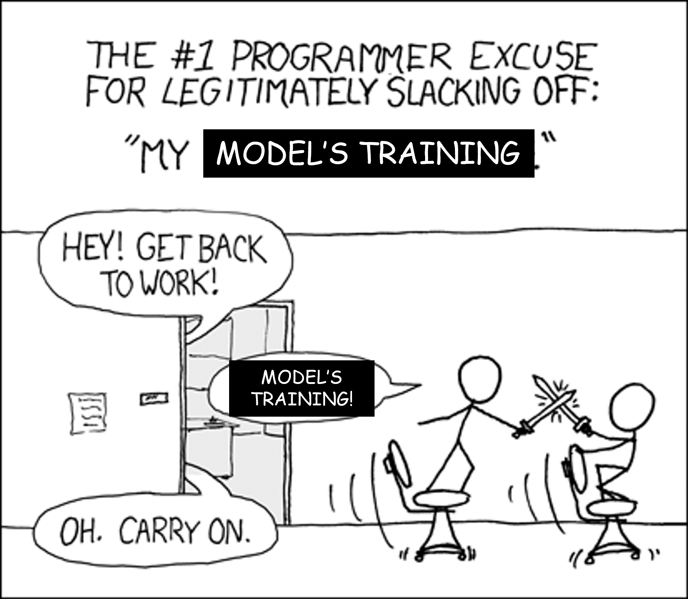
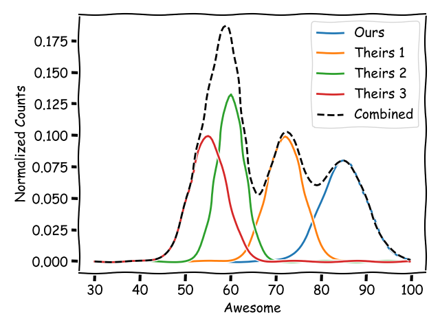
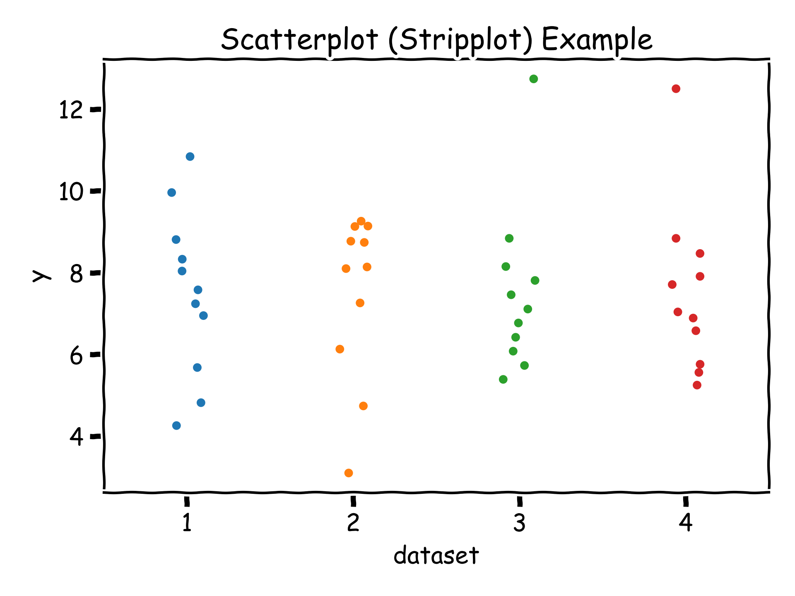
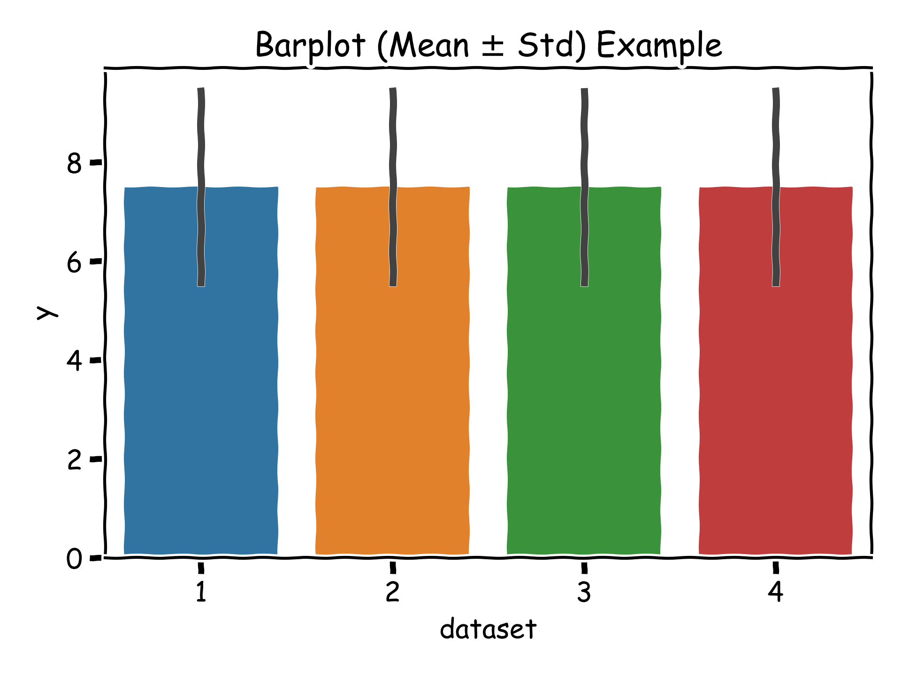
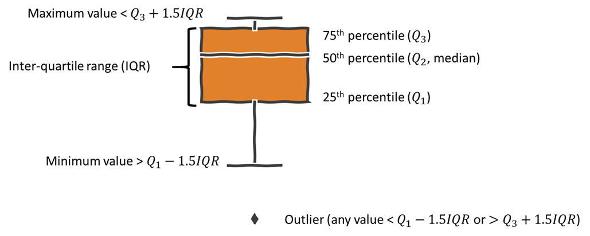
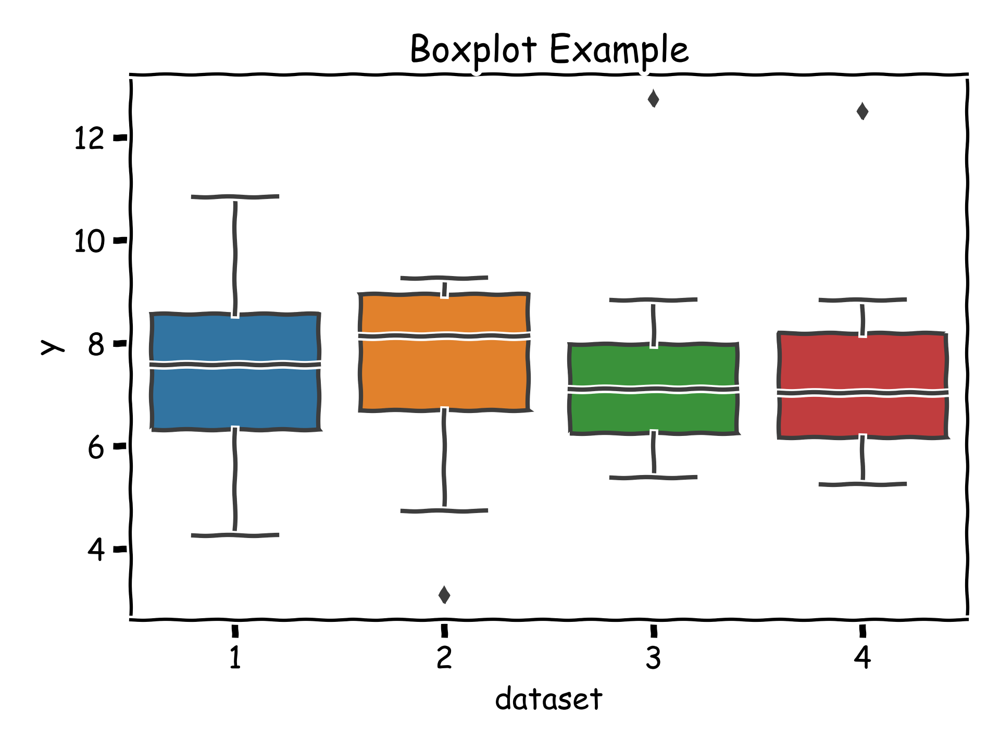
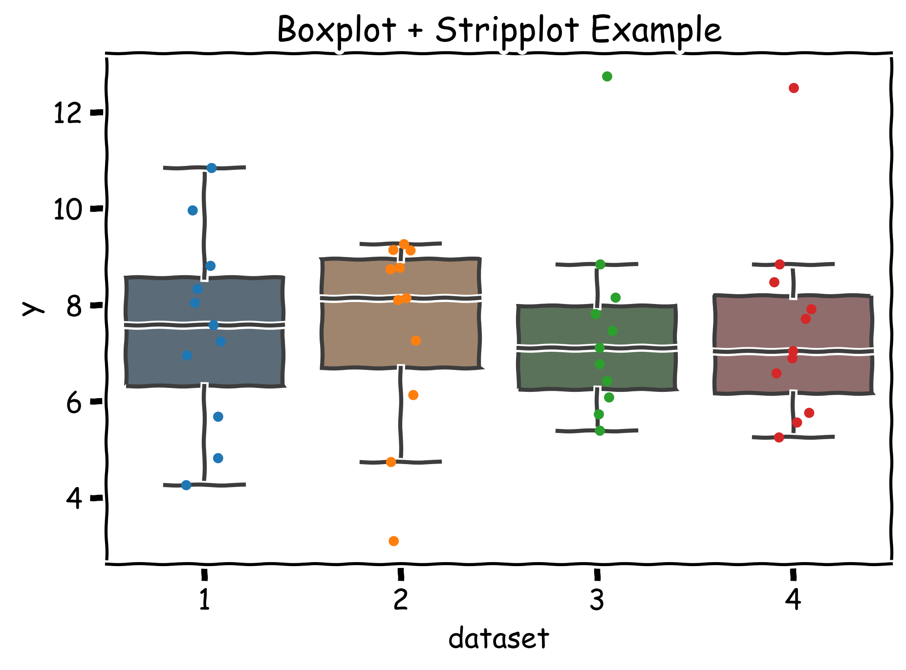
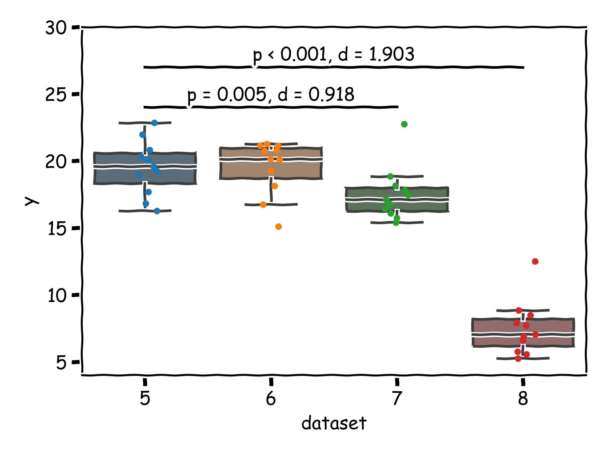

# Statistical Analysis Workflows

>To call in the statistician after the experiment is done may be no more than asking him to perform a post-mortem examination: he may be able to say what the experiment died of. – Sir R.A. Fisher

## Learning Objectives
* Design the components of a scientific experiment with a machine learning model as the subject
* Frame experiments in the context of statistical models
* Describe the procedure of omnibus and post-hoc test, with multiple comparison corrections
* Understand basic principles for visualizing comparisons of groups and descriptive statistics
* Use appropriate terms and visuals to communicate inferential statistical results

---

Bottom-Line Up Front:
* State your null and alternate hypotheses
* Have a statistical analysis plan (i.e. what visualizations and tests you will use in what order) _before_ you start gathering/generating data
  * Have justifications for _why_ you are using the plan, and when you will deviate from it
  * If you are using techniques that are not common in the ML literature (but you know to be correct), cite your sources to get ahead of your reviewers
* Develop an experimental design that will get you the data you need to fit your analysis
* Communicate what you did clearly

---

It's time to tie everything back together. Let's recap: We started out in the first lecture illustrating the scientific woes of the machine learning experimentalist. Then we looked at how to set up and conduct some basic statistical tests with methods that were developed in the early 1900s, and some of the ways they've been misunderstood. Then we proceeded to examine some issues specific to common machine learning workflows, with solutions that were developed since the late 1990s.

Having armed ourselves with appropriate tools and techniques, let's pull back and examine experiments as a whole. We'll apply what we've learned in a broader, chronological context, and make a few pit stops to check in on things we haven't mentioned yet - omnibus testing, and visualizations.

## Experiment Design

First, some terms, and a general timeline for designing an experiment.

|Term               | Definition |
|------             |----        |
|Factor             |a categorical explanatory independent variable  |
|Factor Level       |a specific value of a factor |
|Treatment          |a particular combination of factor levels |
|Response           |the outcome(s) of interest, the dependent variable(s) |
|Randomization      |radom allocation to experimental treatment and order of experiment runs; used to average extraneous factors, minimize systematic bias |
|Replication        |independent repetitions of each factor combination; used to estimate experimental (aleatoric) uncertainty

The general flow of an experiment  goes something like the following, which is the pattern that we're going to follow during this lecture[^Montgomery17].

1. State the general research problem
2. Select the response variable
3. Choose factors, factor levels, and ranges
4. State specific hypotheses from the elements above
5. Choose experiment design
6. Perform the experiment
7. Analyze the data
8. Make conclusions and recommendations

[^Montgomery17]: Adapted from Montgomery, Douglas C. Design and analysis of experiments. John wiley & sons, 2017.

As a running illustration in this lecture, we'll examine a notional experiment that uses a novel quantum-blockchain-deep-SaaS-powered neuromorphic network on a chip to produce Awesome.

We want to examine variants of our architecture against three competing architectures, along with some other factors. The factors and factor level are thus:

|Factor             | Factor Levels |
|------             |----           |
|Pre-Training       |yes, no        |
|Model Architecture |ours, theirs 1, theirs 2, theirs 3|
|Model Size         |L, XL, XXL|

with a predictor of Awesome (continuous real-valued units of "_ohhh, ahhhh_").

For this lecture, we'll restrict ourselves to this illustration that considers _categorical_ factor levels and a _ratio_ predictor.

## Pre-Experiment Decisions (Steps 1-4)

Steps 1-4 are going to be specific to individual studies, though as we've seen, in the machine learning space, the choice of factors, levels, and ranges is often done in an ad-hoc manner, and the statement of hypotheses tends not to be done at all. Steps 1-4 should, however, really be in your pre-experiment planning.

As a matter of hypotheses, we will posit the following null hypotheses:

$H1_{0}: \mu_{yes} = \mu_{no}$

$H2_{0}: \mu_{ours} = \mu_{theirs 1} = \mu_{theirs 2} = \mu_{theirs 3}$

$H3_{0}: \mu_{L} = \mu_{XL} = \mu_{XXL}$,

with the alternate hypotheses in each case being that at least one of the comparisons is an inequality.

Now $H1_{0}$ probably looks familiar, but perhaps the other two hypotheses do not! We are using hypotheses about means of more than one group! The $t$-test can't do that!

No, the $t$-test can't, but yes, we are going to compare more than one group. We'll get there[^ANOVA].

[^ANOVA]: Confession - I'm sneaking a bit of ANOVA into here because it's extremely useful, but seemed like a bit much to also include in Lecture 02.

A question that naturally comes up after or concurrently with those sets of decisions is the choice of $N$ - how many individual "units" of the experiment do you have? Recall that what this is can vary, and occurs at both the "training runs" and "inference samples" levels for ML, generally depending on if your questions are about methodology or instances of models.

In our case, the smallest unit of the experiment is a fairly straightforward treatment of one particular choice of 1) pretraining, 2) architecture, and 3) size. That gives us a total of $2 \times 4 \times 3 = 24$ treatments to deal with before considering replicates. Because we are making claims about methods rather than instantiated models, we do need to consider more than one replicate, rather than just the number of test examples we use (which we'll assume is sufficiently large).

From before, we cited Norman, who made a general argument that parametric statistics were valid when there were down to about five replicates per treatment[^Norman10]. A more thorough treatment of this question can be done with _power analysis_, which tries to answer the question of how many samples it would take to reasonably conclude that a dependent variables difference of some given size is actually present. Oftentimes, this involves doing a _pilot study_ to estimate the size of the difference, but we will not get into these questions here. Perhaps the more important question is that of ecological validity, as mentioned in the previous lecture. For now, we'll just go with Norman and ignore the other issues.

[^Norman10]: Norman, Geoff. "Likert scales, levels of measurement and the “laws” of statistics." Advances in health sciences education 15.5 (2010): 625-632.

## Experiment Design (Step 5)

Having stated your hypotheses, it is now time to design your experiment. Consider what constraints you have and which comparisons you might want to focus on. Your hypotheses should already tell you what your factors are, but what are your factor levels? Is there randomness that you want to try to control? Are you conducting a _full-factorial_ study (all combinations of all factors) or a fractional factorial study (only some combinations of factors)? Are these specific model states that you want to make sure you save out?

Answering these questions should give you a sense of the scale of protocol for your experiment. Basic experimental designs are generally fairly straightforward, and can be built directly on top of the types of hypothesis testing we've covered thus far in this course. More advanced experimental designs are often semester-long courses.

For simplicity, in our running illustration, we are conducting a full-factorial study, say with 10 replicates (models trained from random seeds).

## Perform the Experiment (Step 6)

In ML world, this often means setting up a bunch of training and testing runs, maybe some shell scripts for batch processing, and a few emails to the cluster staff if you're lucky to have access to cluster and the associated staff.

This is a great time to start the writeup of your study, catch up on emails, have a drink, take a nap... the world is your oyster.

## Analyze the Data (Step 7)

There are a lot of things to do here, so let's look at them in turn.

### Look at the data (7a)

Great, now you've conducted your experiment. It's time to take an initial look at the data, _before_ we do any inferential statistics. As we've been emphasizing throughout this course, means and medians alone are next to meaningless. In fact, the usual notion of plotting means and standard deviations are likely not the best places to start. 

Instead, start with as close to the raw data as you can, while still taking a somewhat "aggregate" view. Visualization formats that do not require error quantification are a good place to begin - histograms, contingency tables, raw time series, and so on. Keep in mind that plots of residuals are also quite helpful. If you have to summarize further, box plots are a good next step, since they preserve some information about the shape of the distribution (we'll come back to visualizations later). Remember that loss values are often not the same as residuals - mean squared error gives you the square of the residual, and you may want the latter at this point.

Let's take a quick look at some things that might happen when you LATFD. Again, we'll focus on continuous, ratio-valued outputs (regressions, accuracies, scores, etc).

___My data are normally distributed.___

Amazing. If you want, you can double-check this with a test of normality (like the Kolmogorov-Smirnov test). All the most powerful parametric tools are now at your disposal.

___My data are not normally distributed, but are symmetric.___

You're probably fine, unless you have very, very few datapoints. Proceed per usual or see below about few datapoints.

___My data are very non-normal, but I don't have any crazy outliers.___

Decent chance you're still okay to use parametric statistical methods.

___I have some pretty serious outliers.___

Okay, let's take a look at those outliers. Do you have any insight into what is causing those outliers? Are the insights sufficient for you to exclude them (and/or re-run your experiment, if needed)? Remember that exclusion of outlier data from further analysis is allowable, but should not be done without justification, or only with the justification that "they're outliers."

If you can't exclude the outliers, it may be time to consider _robust_ or _nonparametric_ statistics. These methods are generally considered more reliable in the face of such data distributions, but are less powerful - that is, they are more prone to Type II error (failing to reject the null hypothesis even though the alternate is true). Though with that in mind, if you _are_ able to reject the null under these conditions, you can be pretty sure that you did so correctly. We won't be discussing the details in this course.

___There is "structure" in my residuals.___

"Structure" means some kind of noticeable, consistent pattern in your residuals related to some feature, such as over-predicting the same phase of a cyclic time series, or misidentifying faces more frequently if they're Black[^NIST19]. This is often a sign of _epistemic uncertainty_, meaning that there is some effect that your model is not capturing, that could, in principle, be accounted for. You may still proceed with statistical analysis at this point (the inferential statistical tests don't really care about the presence or absence of residual structure), but the patterns here should be noted at the very least, and you may want to give some thought to how you might account for this type of error. Or, if things are really bad, and especially if they're really bad and you know of a decent way to consider the effect that your model isn't currently capturing consider starting your experiment over, with the added variable(s) as inputs to your model. Or collect more data, do other kinds of rebalancing, etc.

[^NIST19]: Grother, Patrick, Mei Ngan, and Kayee Hanaoka. Face recognition vendor test (frvt): Part 3, demographic effects. Gaithersburg, MD: National Institute of Standards and Technology, 2019. A not-so-subtle reminder of the potential effects of structure in your residuals.

___I only have like 1-3 data points per group that I'm trying to compare.___

You probably want to consider nonparametrics, but more generally, you want to consider the problem of whether or not your data are generalizable. See the Deep RL at the Edge of the Statistical Precipice paper. Also, if you really can't do further statistics on these data, that's not necessarily a problem, as long as you consider what you're doing here a case study, rather than a full-on experiment. Case studies are quite valuable (the medical community certainly thinks so). If you did intend to do a proper experiment though, probably revisit the experiment design section.

### Omnibus Testing (7b)

Having examined our data as a general sanity check, we now want to do inferential statistics.

Here's where we bring in a new tool: the _Analysis of Variance (ANOVA)_ procedure. The ANOVA setup is one type of _omnibus test_ that lets us do the odd thing before where we had null hypotheses involving more than two parameters at once. We'll talk about it at a high level here (and I'll mention that it's available in basically any statistical package out there), but we won't get into details.

ANOVA is a procedure that uses the $F$-test for equality of variances, and the general setup is

> $$F=\frac{\text{between-group variance}}{\text{within-group variance}}$$

Consider the case of our Model Architecture factor, where our groups comprise of Ours, Theirs 1, Theirs 2, and Theirs 3.

Note that really, these distributions would be histograms, we're just using (really nice, normal-looking) lines for clarity/illustration.

If there are significant differences in the data _between_ each group in comparison to the variance from the data _within_ each group, then $F$ will be large, and return a small $p$ value[^Ftestpval]. A small $p$ value (again, typically taking <0.05 to be significant), means that the associated factor (e.g. model size here) is significant. It _does not_ tell you specifically _how_ the data from the factor levels relate to each other (which one is larger/smaller, etc).

[^Ftestpval]: As with $t$-tests, these $F$ tests also have null and alternate hypotheses. Here, the null is that the variance between groups is the same as the variance within groups.

You can think of ANOVA as a cousin of the $t$-test that allows you to do comparisons beyond two groups. The great thing about it is that you can extend it even further to compare _multiple factors_ at once, each with arbitrary numbers of levels[^nway]! The only limitations are that factor levels must be categorical.

[^nway]: Single-factor ANOVA is commonly called the one-way ANOVA, with two-factor being called two-way ANOVA, and $N$-factors being called $N$-way. ANOVA also allows for examinations of interactions between factors, but that is deeper magic than we will cover here.

ANOVA is subject to the same arguments that Norman (2010) made about $t$-tests (in fact, that paper was primarily about ANOVA, and only about $t$-tests in passing), so we are likely able to use it in many more circumstances than many people may assume. However, I do believe that the ANOVA procedure needs to be amended with the Nadeau-Bengio correction for cross-validation[^unverified], something that I strongly doubt is in practically any traditional statistics package. We will ignore this for now[^package].

[^unverfied]: I'm pretty sure this is true just following the logic of the variance correction, but this statement has not been peer-reviewed (i.e. I haven't found a peer-reviewed source saying as much for ANOVA). All applications of the Nadeau-Bengio correction that I have seen stop at $t$-tests.

[^package]: Maybe it's time to add it to the open-source packages.

The ANOVA procedure returns a table of results. A highly simplified version for our running example might look like this[^notional]:

|Source of Variation|p-value|
|-----|-----|
|Pre-Training|0.231 |
|Model Architecture|0.020 |
|Model Size|0.091 |

[^notional]: Does it really make sense that pre-training and model size have _no_ effect? Probably not. But remember that this is a _notional_ example that produces Awesome. High tech stuff that we don't understand fully yet.

Aha! Now we see that we can accept the null hypotheses about pre-training and model size, but we have to reject our null hypothesis about model architecture! Doing so automatically spawns a couple of new hypotheses, but notably, performing the ANOVA has stopped us from $t$-testing our way through every treatment, dramatically lowering the number of pairwise comparisons we have to make.

<!-- ### Categorical Independent Variables, Continuous Dependent Variables

This is one of the more common types of input/output we have in statistical analysis of machine learning systems - we want to compare two or more models (categorical) by some performance metric (continuous)[^WhyCategorical].

[^WhyCategorical]: Remember that even if your models are related by some interval or ratio datatype (e.g. this neural network has 8 layers vs the other one with 6 layers), it is still fair to compare them as categorical due to the ordering of data scales. See _Types of Data_ in the math supplement.

Questions of variance typically fall under the category of $F$-tests (that is, tests that use the $F$ distribution), and in this case, we're concerned with the family of ANOVAs, or Analysis of Variance. These are often called "omnibus" tests, and the more common forms are built into just about every statistical package ever.

In our working example, all of our factors are categorical[^ratio], and our predictor is continuous, so we can use an ANOVA.

[^ratio]: Model size technically might be ratio/continuous if we're only varying one thing (e.g. number of layers), but it's safe to consider these categorical as well as a coarse level.

___TODO___ - example ANOVA table

### Continuous Independent Variables, Continuous Dependent Variables

This is the realm of correlation ___TODO___ -->

<!-- ### More Complicated Setups

More complex experiment setups, including any of the following:

* direct modeling of both controlled and uncontrolled variables,
* blocked experimental setups,
* fractional factorial setups,

etc, start to fall into the realm of generalized linear models, mixed effects models, and the like, typically not covered in depth until graduate statistics and/or experiment design courses. We will not cover these items here.

I would recommend Montgomery's _Design and Analysis of Experiments_[^Montgomery17] and Kutner's _Applied Linear Statistical Models_[^Kutner96] for further reference.

[^Montgomery17]: Montgomery, Douglas C. Design and analysis of experiments. John wiley & sons, 2017.

[^Kutner96]: Kutner, Michael, et al. "Applied linear statistical models." (1996): 318. -->

### Post-Hoc Comparisons (7c)

Now that you've shown that there is *some* variability in the explained by one or more of your independent variables, you still need to show that there is a certain directionality to the differences, or that differences exist between specific tested groups.

In our example, there are four factor level in Model Architecture. We could naively just do all pairwise comparisons, but here, we can use some judgement and think about what it is we're after. We only really care about comparisons against _our_ architecture - so we don't really need to do any pairwise comparisons against a pair of architectures that isn't ours.

That leaves us with three hypotheses:

$H2.1_{0}: \mu_{ours} \leq \mu_{theirs 1}$

$H2.2_{0}: \mu_{ours} \leq \mu_{theirs 2}$

$H2.3_{0}: \mu_{ours} \leq \mu_{theirs 3}$

These are now pairwise comparisons, and we are comfortably back in $t$-test territory (with multiple comparison corrections). So perform a set of three $t$-tests, and if you're using the Bonferonni correction, just divide $\alpha$ by 3[^alpha].

[^alpha]: Typically, multiple comparison corrections are only done considering the number of "simultaneous" tests being performed. That means that if you follow up with other tests in a different part of your experiment, you don't count those in your correction. Technically, N-way ANOVA performs multiple simultaneous $F$-tests, but those are also not customarily corrected for multiple comparisons. I am not entirely sure why.

Consider what we've just done here. We started out with 24 treatments. If we had just rushed ahead and conducted our pairwise $t$-tests, we would have needed to perform $_{24}C_2$ = 276 tests, leaving lots of room for error. Now we're doing three.

Remember to calculate effect sizes along with statistical significance.

## Make Conclusions and Recommendations (Step 8)

Congratulations, you've reached the end of the statistical analysis! Do with the end result what you will. I don't know what you're doing to do with all that Awesome you've generated, but I'm sure you'll put it to good use.

## Communicating What You Did - Words

_Science_ (the journal) recommends the inclusion of a statistical analysis section in your methods section, a recommendation that I heartily concur with. This is a good place to give a roadmap of sorts about what your statistical plan of attack is. Presumably, by the time you get to the end of your methods section, you've already outlined your hypotheses (if not, this would be a decent place to do so, but consider moving your hypotheses further up). With your hypotheses out of the way, describe your general experimental design at a high level, followed by what kind of omnibus test(s) you might perform, and what post-hoc comparisons you'll make (if your analysis happens to follow that path). Note any corrections you might be performing (e.g. Nadeau-Bengio variance correction, Bonferroni or other multiple comparison correction, etc), taking into consideration what is common to the field you are speaking to and what norms do or don't exist there. Cite your sources when you're doing things that are unusual to the field, or that people might disagree with (you, having done your homework, are correct in your methodology, and just need to point out why).

As an example, a statistical analysis paragraph might look something like this:

> We performed a three-way ANOVA for the three experimental factors, followed by post-hoc pairwise comparisons using $t$-tests for factors deemed significant. The $t$-tests used the Nadeau-Bengio correction for variance on our $k$-fold cross-validation, and a Bonferonni correction was applied for multiple comparisons. Pairwise testing was performed for all other architectures against Our Architecture.

In your results, say which factors came out non-significant, and which ones came out significant, with their associated $p$ values, something like 

> ANOVA showed that model size ($p=0.331$) and pre-training ($p=0.453$) were not significant factors in model accuracy, though model architecture was significant ($p=0.020$).
> 
> Post-hoc pairwise tests comparing architectures showed that Our Architecture outperformed Theirs 1 ($p=0.002, t(9)=3.83, d=0.42$), Theirs 2 ($p=0.011, t(9)=2.76, d=0.31$), and Theirs 3 ($p=0.009, t(9)=2.89, d=0.33$).
> 
> Therefore, we can reject the null hypothesis in all three cases and accept the alternates that our model architecture produces more Awesome than any of Theirs.

Notice that the results of $t$-tests are often shown as $t$(degrees of freedom) = $t$-statistic, along with $p$ (and I would recommend adding $d$ for significant cases). If you have many results like this to show, a table is a good option.

## Communicating What You Did - Visuals

We've already discussed how we're never going to just report means or medians alone, but as we've also seen from Lecture 01, means and standard deviations can also be deceptive. Here are some general heuristics (not laws) about data presentation. Adjust as necessary for the circumstances of your experiment[^Tufte83].

[^Tufte83]: For much more about visuals, a classic text is Tufte, Edward R.. The visual display of quantitative information. Spain, Graphics Press, 2001.

For illustrative purposes, we'll now abandon our previous running example. Instead all of the plots below were created using the y-axis data of _Anscobe's Quartet_ unless otherwise noted.

__Showing Raw Data and Summary Statistics__

* Only raw values should ever be presented without dispersion measures, and in these cases, tables of counts (or percentages) and histograms are the most common approaches for aggregate data.

* If you only have a few samples per group in your visualization, just show the raw values themselves. This is particularly true in the case of expensive ML experiments where the number of models trained is very small. The example shown below is a single-axis scatterplot called a stripplot. Jitter is intentionally added to data along the categorical axis to improve readability.

* Plots or tables of means and standard deviations should only be used if you have verified that the data being represented are approximately normally distributed. Otherwise, these can be misleading and in some cases, can result in errorbars crossing established limits on the data (e.g. negative values, or values $>100\%$ when they should not be possible). In the Anscombe's Quartet data below, we can clearly see that this is not a great representation, because the distributions of the data are largely hidden. To be clear, Anscombe's Quartet is a case where this kind of plot should _not_ be used.

* Plots or tables of means and standard _error_ (SEM, $s/\sqrt(n)$) should generally be avoided unless you have a specific reason for their use. Standard error can be made arbitrarily small by increasing the number of samples, making the figures/values misleading. Small standard errors are informative in that they lend support to tests of differences of means you may do, but you should just do the statistical test in that case.

* Box plots are an excellent option in many cases, since they give a minimum of 5 pieces of information about the data distribution per group (more if there are outliers, or you use features like mean lines and notches). They tend to be a good balance between showing enough to be honest about your results, and not showing so much that the figure is cluttered. Importantly, this type of plot will show a general shape of the data distribution while also clearly highlighting any outliers. We can see much more clearly, for example, that datasets 3 and 4 are much more similar to each other than any of the others, matching the raw data seen above.

* You can also combine visualizations. The combination of a stripplot and a boxplot have the summarization properties of the boxplot, while retaining the more detailed information of the stripplot.

* You can also separate visualizations (or data). If, for example, your variance for all groups is quite large in comparison to the difference in means between groups, dispersion visualizations can overwhelm the visualization of the mean. Instead, consider just using two separate plots (or tables).

| Representation | Values Shown per Group | Notes                              |
| -------------- | ---------------------- | ---------------------------------- |
| scatterplot    | $N$                    | only feasible for small $N$        |
| barplot + std  | 2                      |                                    |
| barplot + SEM  | 2                      | avoid this kind of plot in general |
| boxplot        | $\geq$ 5               |                                    |

__Showing Inferential Statistics__

* Significant differences are denoted by a bar above pairs of groups that have these differences. Oftentimes, asterisks above the bar are used to denote the level of significance. But you can usually do even better for the same amount of space by just writing the associated $p$ value directly, so I'd recommend that in lieu of asterisks when you have the space. While you're doing that, you might as well also include the effect size.

The figure below was generated with a shifted version of the Anscombe's Quartet y-axis data.

The significance bars above denote that the pairwise comparisons between _ours_ and _theirs 2_ was significant at $p=0.005$, and the one between _ours_ and _theirs 3_ was significant at $p<0.001$. Implicitly, there was no significant difference between _ours_ and _theirs 1_. In this case, we have only performed pairwise comparisons between _ours_ and all the other models, neglecting pairwise comparisons between models that aren't ours. This reduces the number of tests we're conducting, by removing comparisons we don't actually care about (e.g. if our alternate hypothesis was that our model is better than the rest, which in this case, we see is _mostly_ true).

* As you can see above, typically, if your $p$-values are very small, you'll just cut it off and say that it's less than some threshold, for readability. I usually use 0.001 as a cutoff, unless $\alpha$ has been suppressed to be much less than that due to multiple comparisons.

* If you have lots of significantly-different groups, you can do some grouping of significance bars (e.g. "these four groups are all significantly different from this one other group (all $p\leq0.014$)"). You may also omit significance symbols in your figure if needed, in which case, you should be clear what has been omitted in the figure captions or text.

## Closing Remarks

Despite its origins in statistics, the machine learning world often ignores traditional statistics and scientific experiment design to its detriment. Statistical and experimental design tools have existed for much longer than modern machine learning, and many of them are applicable when the subject of your experiments is a machine learning model. Sometimes there are modifications that ought to be considered because of typical machine learning workflows, but methods have been developed to deal with many of those cases, particularly if you give a bit of thought into the the flow of information in your experiment and the claims you want to make.

I hope that this course has convinced you that proper statistical analysis and general scientific methodology will make you a better (and more honest, fair, accountable, transparent, attractive, etc etc) ML engineer.